# 带缓存系统的 4 级流水线 RISC-V 处理器设计、验证与性能评估实验报告

## 项目实现情况介绍

### I. 宏观工作

1. 实现了全参数化 L1 I-Cache, L1 D-Cache 和 L2 Cache 的 RTL 设计，响应延迟、容量和总线宽度参数化的片外主存 DRAM 行为模型，以及可靠的性能计数器（包括上一次实验已经实现的周期、流水线控制行为计数器修改，以及新增各级缓存命中/缺失计数器的实现）；
2. 继承上一次实验的验证平台，面向 Agent Skill 调用和脚本的层级调用需求，对关键脚本的功能做了大量扩展，添加了大量数据分析与可视化功能，并实现了全自动参数探索脚本；
3. 完善了冲突控制信号产生机值，并对流水线设计进行了优化；
4. 完善了测试程序，包括三种矩阵乘法测试例，以及大数组顺序访问与质数步长访问测试例的实现；
5. 进行参数探索（包括关联性和局部性分析），分析结果图表，确定了一套性能比较优秀的架构参数设计方案；
6. 对最终的带缓存 CPU 进行了综合实现，获得并分析了 PPA 数据；特别地，对于功耗分析，还执行了 GLS 后仿作为额外数据支撑；
7. 在 Docker 中，用 Ollama + LangChain + Streamlit 搭建了 LLM 交互界面（用户界面和仿真脚本界面），让 LLM 可以解码用户需求，然后调用仿真脚本完成任务。
8. 将项目开源到了 GitHub 上。

### II. 功能实现

#### 缓存系统具体实现

##### 缓存系统微架构图

<div style="display: flex; justify-content: center; align-items: flex-start; gap: 15px; text-align: center;">
    <div style="display: flex; flex-direction: column; align-items: center; flex-shrink: 1;">
        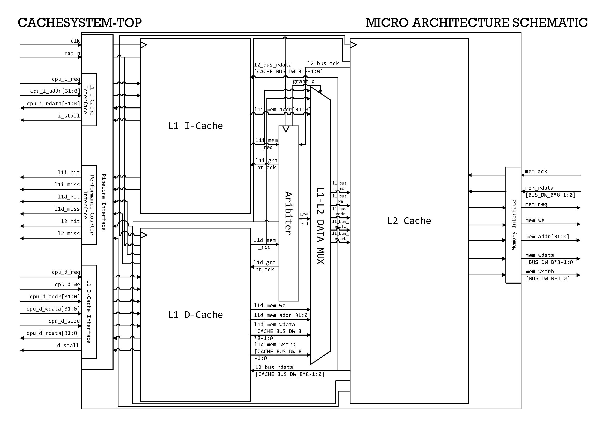
        <span style="font-size: 14px; color: #666; margin-top: 8px;">图 1：Cache 系统顶层微架构</span>
    </div>
    <div style="display: flex; flex-direction: column; align-items: center; flex-shrink: 1;">
        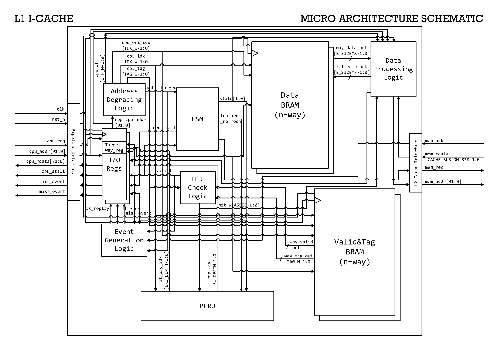
        <span style="font-size: 14px; color: #666; margin-top: 8px;">图 2：L1 I-Cache 微架构</span>
    </div>
</div>

<div style="display: flex; justify-content: center; align-items: flex-start; gap: 15px; text-align: center;">
    <div style="display: flex; flex-direction: column; align-items: center; flex-shrink: 1;">
        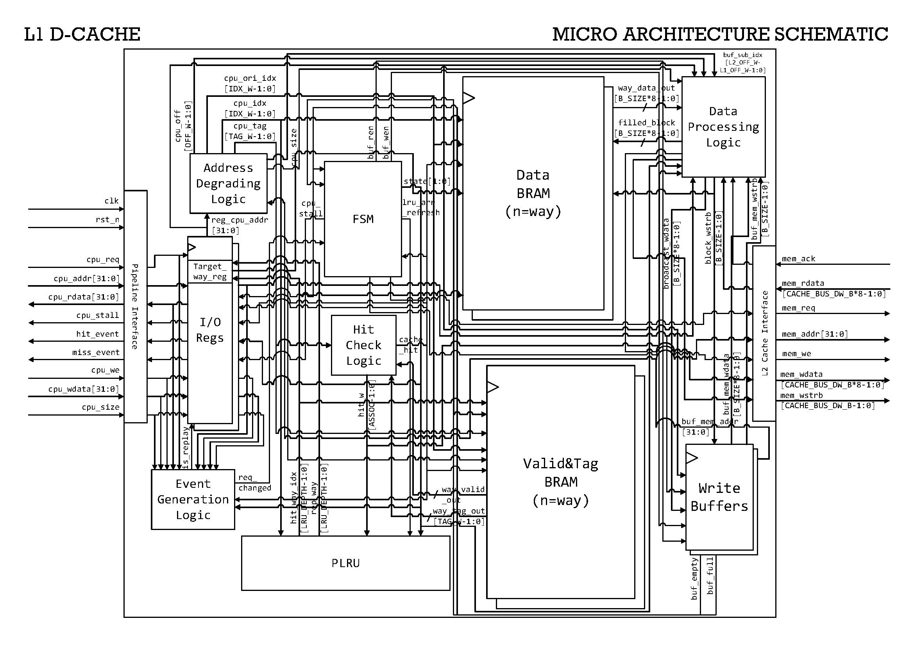
        <span style="font-size: 14px; color: #666; margin-top: 8px;">图 3：L1 D-Cache 微架构</span>
    </div>
    <div style="display: flex; flex-direction: column; align-items: center; flex-shrink: 1;">
        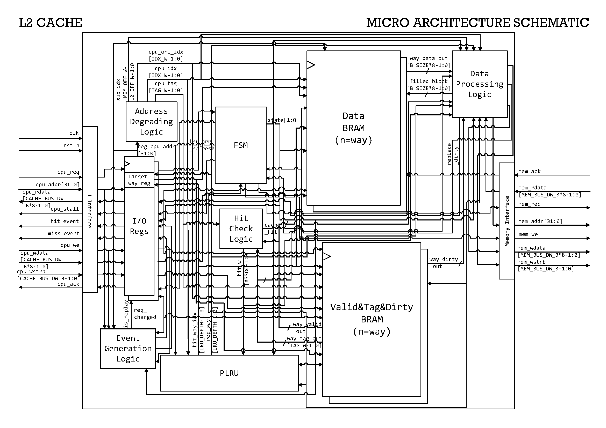
        <span style="font-size: 14px; color: #666; margin-top: 8px;">图 4：L2 Cache 微架构</span>
    </div>
</div>


##### 各级缓存状态机

> * 次态默认保持现态；
> * 控制信号输出默认为 0；
> * `default` 状态均为 IDLE。

<div style="display: flex; justify-content: center; align-items: flex-start; gap: 15px; text-align: center;">
    <div style="display: flex; flex-direction: column; align-items: center; flex-shrink: 1;">
        
        <span style="font-size: 14px; color: #666; margin-top: 8px;">图 5：L1 I-Cache 状态机</span>
    </div>
    <div style="display: flex; flex-direction: column; align-items: center; flex-shrink: 1;">
        
        <span style="font-size: 14px; color: #666; margin-top: 8px;">图 6：L1 D-Cache 状态机</span>
    </div>
    <div style="display: flex; flex-direction: column; align-items: center; flex-shrink: 1;">
        
        <span style="font-size: 14px; color: #666; margin-top: 8px;">图 7：L2 Cache 状态机</span>
    </div>
</div>


##### 各级缓存以及缓存系统顶层的架构设计

1. L1 Cache:
	1. 使用 Verilog `parameter` 和 `localparam` 控制模块接口和内部信号位宽，利用 `generate` 块和条件编译开关对架构具体实现进行控制，实现对全可配置架构参数的支持：包括缓存容量、缓存块（行）大小、关联度与片上总线位宽（默认参数取值为容量 8KB、块大小 32B、关联度 2 路、总线位宽 64B）；
	2. 使用 `xpm_memory_sdpram` IP 实现 `data` , `valid` 和 `tag` 阵列（按路实例化），以优化物理实现效果，逼近工业实现方案；
	3. 实现了支持参数化的 PLRU，并做了直接映射情形的 Bypass，避免静态展开阶段出错；
	4. L1 D-Cache 借助自研 FIFO 实现了写直达 + 写缓冲的写策略，并对字节访存、写数据传输掩码功能做了支持；
	5. 用状态机实现了缓存的行为控制与控制信号输出，正确处理 CPU 访存请求和 L2 Cache 的应答返回，产生正确的 CPU 应答信号（也就是 `stall` 信号）和 L2 Cache 请求信号，并通过辅助时序块实现了命中/缺失事件脉冲信号输出；
	6. 基于状态机状态和控制信号输入，实现了数据通路设计；
	7. 通过对数据通路和状态机的调整，实现了对 BRAM 的支持（至少 1 周期读、写延迟）。
2. L2 Cache:
	1. 使用 Verilog `parameter` 和 `localparam` 控制模块接口和内部信号位宽，利用 `generate` 块和条件编译开关对架构具体实现进行控制，实现对全可配置架构参数的支持：包括缓存容量、缓存块（行）大小、关联度与片上、主存总线位宽（默认参数取值为容量 64KB、块大小 64B、关联度 4 路、片上和主存总线位宽 64B）；
	2. 使用 `xpm_memory_sdpram` IP 实现 `data` , `valid` , `tag` 和 `dirty` 阵列（按路实例化），以优化物理实现效果，逼近工业实现方案；
	3. 实现了支持参数化的 PLRU，由于 L2 一般不做成直接映射的架构，没有做直接映射情形的 Bypass；
	4. 实现了写回 + 写分配的写策略，并对字节访存、写数据传输掩码功能做了支持；
	5. 用状态机实现了缓存的行为控制与控制信号输出，正确处理 L1 Cache 访存请求和主存的应答返回，产生正确的 L1 Cache 应答信号和主存请求信号，并通过辅助时序块实现了命中/缺失事件脉冲信号输出；
	6. 基于状态机状态和控制信号输入，实现了数据通路设计；
	7. 通过对数据通路和状态机的调整，实现了对 BRAM 的支持（至少 1 周期读、写延迟）。
3. Cache System Top:
	1. 实例化两级缓存并连线；
	2. 实现片上总线仲裁器，置 L1 D-Cache 优先于 L1 I-Cache，当总线忙时，维持当前主人的权限；
	3. 引出参数化配置接口。

#### 行为级主存实现

1. 支持响应延迟、总线位宽和主存容量可配置；
2. 对输入的访问地址进行偏移映射，即保持总线位宽对齐，并将 CPU 地址 `0x80000000` 映射到本地地址 `0x0` ；
3. 使用状态机和计数器实现访存延迟模拟；
4. 对字节掩码访存做了支持。

#### 性能计数器修改与实现

本次设计中，在所有性能计数器的采样前做了事件信号的寄存化，防止流水线行为引起的漏采样。

在保留原有流水线周期、停顿和冲刷计数器的基础上，增加了各级缓存命中和缺失事件的计数器。

尽管在 Cache 中做了命中/缺失事件信号的脉冲化处理，缓存命中/缺失性能计数器的采样逻辑中，还是加入了边缘（上升沿）提取处理以提高可靠性。

#### 冲突处理机制的完善

加入缓存系统后，流水线的停顿和冲刷机制需要完善，因为缓存的访问有延迟，原先的冲突处理机值只支持无延迟访存。

1. 流水线停顿逻辑：
	1. 对于 `pc_reg` 和 IF-ID 流水线寄存器，现在触发缓存访问时也要停顿（原先的 `load-use` 情形仍然需要停顿），但是在触发跳转冲刷时无需停顿（否则会因为无法获取正确地址造成死锁）；
	2. 对于 ID-EX 和 EX-MEM/WB 流水线寄存器，只需在触发缓存访问时停顿即可；
2. 流水线冲刷逻辑：
	1. 对于 IF-ID 流水线寄存器，只需在发生跳转时冲刷错误的控制信号；
	2. 对于 ID-EX 流水线寄存器，除了跳转，还需在 `load-use` 情形下、且未触发缓存访问时冲刷错误信号（`load-use` 在这个阶段才能探测到，但是由于不能影响访存，我们要排除缓存访问的情形）。

#### 设计的其他修改

1. 原先的设计中，流水线寄存器冲刷时处理了一些不必处理的寄存器，现设计只对控制信号进行冲刷；现设计中流水线寄存器的使能信号统一为流水线停顿信号取反；
2. 处理器顶层做了比较多的修改，以支持条件编译和架构配置：
	1. 引出缓存架构参数配置接口（引到 `tb_cpu` 中，然后通过仿真命令传入）；
	2. 通过条件编译，引出 GLS 仿真时（主存被挪到验证平台中）需要的主存相关信号；
	3. 针对 GLS 仿真和 Baseline 仿真（无缓存情形），做了内部线网声明的条件编译；
	4. 缓存读取 MUX 现在需要选择大量的性能计数器（这些计数器被映射到了特定地址上），为了减少组合逻辑深度，将原先的优先 MUX 改为了平行 MUX；写回 MUX 通过打断逻辑链路（复用一级中间 MUX）进行了优化；
	5. 对主存实例化进行了条件编译（包括相关的信号逻辑处理）：
		1. 在 GLS 仿真情形，不例化；
		2. 在有缓存情形，例化一个；
		3. 在无缓存情形，指令和数据各例化一个；
		4. 对于综合实现，不开启条件编译，而是直接在编译文件列表中去除主存行为模型（也可以使用 stubborn 模型以减少 warning）。

#### 针对性测试程序实现

由于验证平台支持 C 语言测试例的编译与处理，新增测试程序全部使用 C 语言实现。

1. 矩阵运算测试例：
	1. 三个测试例为 Agent Skill 的修改留出了配置接口，并使用同一个框架，只是矩阵乘法实现函数有所区别；
	2. 为了防止在编译优化程度不同时，对乘法展开的处理不同（`riscv64-unknown-elf-gcc` 可能会在某些情形下编译出 RV32I 不支持的乘法相关指令），将该函数用内联汇编实现，并声明为 `always_inline` ；
	3. 三个测试例的矩阵运算函数分别使用 Naive 方法（$\mathbf B$ 矩阵按列访问）、$\mathbf A$ 和 $\mathbf B$ 矩阵均按行访问以及行访问 + 分块矩阵；
2. 大数组访问测试例：
	1. 在前期，这两个测试例使用普通 C 代码实现，但是发现编译器会对程序进行优化（使用栈访存等），导致缓存缺失率并不会出现预期的行为，即随机访问/质数步长访问缓存缺失率远高于顺序访存。后来统一使用内联汇编进行实现，对缓存访问行为进行控制，得到了预期的结果；
	2. 使用随机访问策略时，由于 RV32I 可实现的随机数策略限制，随机访问的情形访存空间很小，会导致缓存缺失率与顺序访存相近甚至比顺序访存更低。后来改为使用按质数步长访问，缓存缺失率就高了很多。

#### 仿真脚本的扩展与新脚本编写

1. 单测试例仿真脚本（扩展）：
	1. 针对在 Docker 中运行的需求，对 `Conda` 和 `riscv64-unknown-elf-gcc` 环境变量进行了隔离；
	2. 统一用于 DUV 和用于 Spike 的汇编源码；
	3. 针对仿真脚本层级调用和 Agent Skill 需求，增加命令行参数，并支持
		1. 对缓存系统架构参数、主存参数进行配置
		2. 在运行大规模测试例时跳过无缓存情形的测试（仿真会超时）
		3. 在运行大规模测试例时禁用 vcd dump（加快仿真速度，减少存储空间占用），这在参数探索与关联性分析、Agent Skills 实现中，均默认开启（稳定版本无需生成波形用于 Debug）
		4. 配置 `gcc` 编译优化水平
		5. 选择仿真目录
		6. 对同一测试例，复用汇编源码、`.mem` 文件、Spike 仿真结果和 golden_trace 等软件结果（尤其是对于规模较大的测试例，Spike 仿真时间很长）
		7. 生成 `.saif` 文件（记录 DUV 内部信号翻转情况），用于综合实现时的功耗分析
		8. 执行 GLS 后仿（需首先通过综合实现获得 netlist）
		9. 综合实现策略选择（用于匹配 GLS 后仿时 netlist 生成的策略）
	4. 增加性能分析结果，包括
		1. 在终端中打印有无缓存情况下各自的仿真总时钟周期数、CPI，有缓存情况下各级缓存命中数和缺失数表
		2. 计算并在终端打印各级缓存命中率、AMAT 和加速比表
		3. 将仿真总时钟周期数、CPI、各级缓存命中率、AMAT 和加速比表，与存储系统架构参数表一起保存为 `.txt` 和 `.csv` 文件
		4. 绘制有无缓存情形下的总执行周期数对比图、有缓存情形下各级缓存缺失率热力图，并保存到仿真目录下
2. 参数探索与关联性分析脚本（新增）：
	1. 通过调用单测试例仿真脚本、传入对应的参数，自动多线程执行单一参数影响、关联性分析和局部性的关联分析所需要的仿真；
	2. 自动解析各仿真目录下的结果数据，然后针对三种探索情况生成总结图表，包括
		1. 单一参数影响：9 种参数配置情况各自运行矩阵乘法分块版本和数组顺序访问得到的各级缓存命中率、总执行周期数、CPI 和 AMAT 结果表（ `.csv` 和 `.txt` ）和 AMAT 对比图
		2. 关联性分析：三种块大小配置下各级缓存缺失率与相联度关系的折线图，以及块大小为 32B 时 AMAT/CPI 与相联度关系的折线图
		3. 局部性关联分析：对于同一缓存配置，执行时间关联性好的程序（斐波那契数列计算）、空间关联性好的程序（大数组顺序访问）和关联性差的程序（大数组质数步长访问），各级缓存的缺失率折线图

#### 综合实现流程说明

尽管使用 Vivado 可以进行比较严谨的时序和面积（资源使用情况）分析，但经过实践验证，它无法给出严谨的功耗分析。下面给出实验过程中的两种功耗分析策略，并分别说明优劣。

1. 前仿：先使用单 case 仿真脚本（开启 `--gen_saif` 开关）获取前仿翻转率信息，然后在综合的时候开启 `-flatten_hierarchy rebuilt` 开关，保留各层级设计。在功耗分析中读入 `.saif` 文件，对各层级功耗进行分析，最后整合后获取报告；而在物理实现过程中，正常按照非 flatten 情形进行，以获得最好的布局布线效果，提高整体电路的性能和面积表现。这种方法对翻转率的匹配程度比较好，但是由于和综合实现后真实的布局布线情况不同，得到的功耗数据很可能偏高。
2. 后仿：先使用综合实现脚本，正常按策略运行，导出网表和 `.sdf` 文件，然后使用单 case 仿真脚本（开启 `--gls` 和 `--strategy` 开关，`--strategy` 开关用于选择综合实现的策略）进行 GLS 后仿，得到翻转率信息；再回到综合实现脚本（使用功耗分析模式），读入 `.dcp` 和 `.saif` 文件进行功耗分析。这种方法得出的翻转率信息比较符合实际物理实现的情况，但是限于 Vivado 工具支持，它没法在功耗分析时正常解析 `.dcp`  和 `.saif`文件中网表的对应关系，导致得出的功耗报告中对应到仿真翻转率的 nets 占比低于 10%（其他 nets 按照默认的 12.5% 翻转率进行估计），置信率极低。

最后，经过综合考量，我选择了前仿的功耗分析方案。

#### Agent Skills 实现情况

由于在前面的工作中，已经实现了各功能的的仿真脚本实现，并且留好了调用时的参数化配置接口，Agent Skills 的实现只需搭建专门的 Docker，然后让 LLM 在里面通过 `LangChain` 调用这些脚本即可。对于用户交互部分，选取了 `Streamlit` 方案来搭建网页端交互界面。

1. Docker 配置：
	1. Vivado 的配置采取将宿主机的工具链地址映射到 Docker 中的策略。经过测试，Ubuntu 24.04 与 Vivado 2025.2 版本存在兼容性问题；Ubuntu 22.04 可以完美兼容我们我们用到的工具链；
	2. Conda，`riscv-unknown-elf` 工具链和 Nvidia GPU 推理支持环境由于体积比较小，直接在 Docker 中进行安装；
	3. Spike 和 Ollama 体积稍大，为了避免 Docker 中访问项目网址下载安装过慢，采用本地安装的策略（先在宿主机中将源码压缩包放到项目根目录）；
	4. 对 Docker 中各工具链的路径进行配置，并对单 case 仿真脚本进行修改，隔离各工具链的路径防止出现环境污染；
	5. 启动脚本中进行环境隔离配置，并开启 Ollama 服务，运行 Streamlit App。
2. Skills 封装：
	1. 辅助 skill ：获取 RTL 源码并返回给 Streamlit App；
	2. 获取参数化缓存 RTL 并执行指定的仿真测试：支持对 L1 Cache 的容量、块大小、关联度进行配置，支持测试例的指定，支持运行长时间、大指令数量仿真时跳过 Baseline 情形，会在仿真结束时将生成的性能分析报告和 RTL 源码返回给 Streamlit App，包括 `.csv` 表格和两张结果分析图；
	3. 根据用户指定的矩阵规模和分块大小，自动生成矩阵运算测试例（3 种情形都支持），并自动用默认缓存配置执行仿真，支持跳过 Baseline 情形，会在仿真结束时将生成的测试例 `.c` 、`.s` 源码和性能分析图表一起返回给 Streamlit App；
	4. 自动运行全架构参数探索：直接调用脚本，实时捕获脚本的标准输出以显示进度，在所有探索完成后将三种探索情形的所有分析图表返回给 Streamlit App。
3. 网页端 App 实现：
	1. 调用封装好的 skills，基于 Markdown 实现网页端的 GUI 渲染和用户交互（Streamlit 原生支持），并通过筛选、截断、折叠等策略优化代码显示，然后进一步打包成 tools；
	2. 初始化 Agent，将 App 推送到 Localhost；
	3. 搭建用户 Prompt 交互界面；
	4. 拦截 `.json` 格式的工具调用命令，手动路由到各 tools，并解析返回的图表信息，返回给 LLM 做简要分析，并在网页端渲染 LLM 得出的分析报告。

### III. RTL 关键实现详解

#### Cache Instances

首先解析各级 Cache 的共通部分。总体而言，各级 Cache 通过 `generate` 块和参数化位宽的信号实现了对架构参数可配置的支持，比如 BRAM、命中判断逻辑、PLRU 和数据通路等。

**BRAM Instance & Control Logic**

使用 `generate` 块实现可配置关联度的 BRAM 例化。块内为一路例化两个 BRAM，一个用于存储 CPU 存取的 data，另一个用于存储 tag, valid 和 L2 的 dirty 信息，合并为 meta data（读出时通过位选择进行分解）。BRAM 使用了 Xilinx IP: `xpm_memory_sdpram`，例化为 `"block"` 类型。BRAM 的读写通过 Cache 内状态机、接口控制信号（来自上下游的控制信号，比如 `req` 和 `ack` 等）和 PLRU 的路选通信号等进行控制。

以 L1 D-Cache 为例，`generate` 块的生成逻辑如下：

```verilog
genvar w;
generate
    for (w = 0; w < ASSOC; w = w + 1) begin : GEN_CACHE_WAYS
        // -----------------------------------------------------------
        // 1. Write Enable arbiter (Port A)
        // -----------------------------------------------------------
        wire                meta_we;
        wire [META_W-1:0]   meta_din;
        wire [B_SIZE-1:0]   data_we;
        wire [B_SIZE*8-1:0] data_din;
        wire                ren;
        
        // Data MUX and R/W control
        // Detailed implementation could be found in source code
        assign ren      = ...;
        assign data_we  = ...;
        assign data_din = ...;
        assign meta_we  = ...;
        assign meta_din = ...;
        
        // -----------------------------------------------------------
        // 2. DATA SDP RAM (byte access enabled)
        // -----------------------------------------------------------
        xpm_memory_sdpram #(
            .ADDR_WIDTH_A       (IDX_W           ),
            .ADDR_WIDTH_B       (IDX_W           ),
            .BYTE_WRITE_WIDTH_A (8               ), // 8bit Byte strb
            .MEMORY_PRIMITIVE   ("block"         ),
            .MEMORY_SIZE        ((C_SIZE/ASSOC)*8), // total bit number of 1 way
            .READ_DATA_WIDTH_B  (B_SIZE*8        ), // read whole block
            .WRITE_DATA_WIDTH_A (B_SIZE*8        ), // write whole block
            .READ_LATENCY_B     (1               ), // read port with 1 cycle delay
            .WRITE_MODE_B       ("read_first"    ),
            .MEMORY_INIT_FILE   ("none"          ),
            .MEMORY_INIT_PARAM  ("0"             ),
            .USE_MEM_INIT       (1               )
        ) u_data_ram (
            // port A: write
            .clka   (clk            ),
            .ena    (1'b1           ),
            .wea    (data_we        ),
            .addra  (cpu_idx        ),
            .dina   (data_din       ),

            // port B: read
            .clkb   (clk            ),
            .enb    (ren            ),
            .addrb  (cpu_idx_ori    ), // use the unregistered cpu_idx
            .doutb  (way_data_out[w]),

            .rstb   (~rst_n         ),
            .sleep  (1'b0           ),
            .regceb (1'b1           )
            // skip unused ports
        );
        
        // -----------------------------------------------------------
        // 3. METADATA SDP RAM (word access)
        // -----------------------------------------------------------
        // Similar to data ram, skip (see it's details in source code)
        
        // -----------------------------------------------------------
        // 4. meta data unpack
        // -----------------------------------------------------------
        assign way_valid_out[w] = way_meta_out[w][META_W-1];
        assign way_tag_out[w]   = way_meta_out[w][META_W-2:0];
    end
endgenerate
```

L1 I-Cache 和 L2 Cache 中的实现有略微不同（比如 L2 需要存储 dirty 信息等），具体请见源码实现。

需要注意的是，CPU 的按字节访存功能通过 `BYTE_WRITE_WIDTH_ABYTE_WRITE_WIDTH_A` 参数和 `wea` 信号的共同控制得到了实现。以 L1 D-Cache 为例，`data_we` 信号的 MUX 实现如下：

```verilog
assign data_we = ((state == MISS_FETCH) && mem_ack && (target_way_reg == w)) ? {B_SIZE{1'b1}} :
                 ((state == COMPARE) && cpu_req && cache_hit && reg_cpu_we && !buf_full && (hit_way_idx == w)) ? block_wstrb : {B_SIZE{1'b0}};
```

在发生 miss 时，需要从 L2 处申请一整块新的空间，不进行字节访存，因此掩码设置为全 1；在 COMPARE 状态下，如果在 CPU 请求拉高的情况下，确定发生了 hit 且 buffer 没有满，那么就根据需求进行访存（`block_strb` 对字节访存进行了架构参数化适配），反之则禁止访存（掩码全 0）。

另外，通过 `MEMORY_INIT_PARAM` 和 `USE_MEM_INIT` 实现了 BRAM 上电清零，这样就无需在验证平台中复位阶段手动清零了。

**PLRU**

PLRU 实现过程中，严格遵循了 PLRU 决策树结构，并针对相联度可配置的要求做了适配，包括一般化决策逻辑和直接映射优化。具体实现如下（关键点见代码注释）：

```verilog
// find out hit way
integer i;
always @(*) begin
    hit_way_idx = {LRU_DEPTH{1'b0}};
    for (i = 0; i < ASSOC; i = i + 1) begin: hit_way_check
        if (hit_w[i]) begin
            hit_way_idx = i[LRU_DEPTH-1:0];
        end
    end
end

// way update MUX
assign update_way = (state == MISS_FETCH) ? rep_way : hit_way_idx;

// PLRU tree generation
generate
    if (ASSOC > 1) begin: GEN_PLRU
        localparam SAFE_LRU_W = (ASSOC > 1) ? (ASSOC - 1) : 1;	// static analysis protection for direct mapping
        reg  [SAFE_LRU_W-1:0] lru_array [0:N_SETS-1];
        reg  [SAFE_LRU_W-1:0] curr_tree;
        reg  [SAFE_LRU_W-1:0] nxt_tree;

        always @(*) begin
            curr_tree = lru_array[cpu_idx];
            rep_way   = {LRU_DEPTH{1'b0}};
            nxt_tree  = curr_tree;

            // find replace way from current LRU tree (0: left, 1: right)
            begin : find_rep
                integer node;
                integer d;
                node = 0;
                for (d = 0; d < LRU_DEPTH; d = d + 1) begin: find_rep_way
                    if (curr_tree[node] == 1'b0) begin
                        rep_way[LRU_DEPTH - 1 - d] = 1'b0;
                        node = node * 2 + 1;
                    end else begin
                        rep_way[LRU_DEPTH - 1 - d] = 1'b1;
                        node = node * 2 + 2;
                    end
                end
            end

            // calculate new tree from update_way
            begin : update_tree
                integer node; 
                integer d;
                node = 0;
                for (d = 0; d < LRU_DEPTH; d = d + 1) begin: calc_new_tree
                    if (update_way[LRU_DEPTH - 1 - d] == 1'b0) begin
                        nxt_tree[node] = 1'b1;
                        node = node * 2 + 1;
                    end else begin
                        nxt_tree[node] = 1'b0;
                        node = node * 2 + 2;
                    end
                end
            end
        end

        // PLRU memory update
        integer i;
        always @(posedge clk or negedge rst_n) begin
            if (!rst_n) begin
                for (i = 0; i < N_SETS; i = i + 1) begin
                    lru_array[i] <= {(ASSOC-1){1'b0}};
                end
            end else if (lru_array_refresh) begin
                lru_array[cpu_idx] <= nxt_tree;
            end
        end
    end
    else begin: GEN_DIRECT_MAPPED	// static analysis protection for direct mapping
        always @(*) begin
            rep_way = {LRU_DEPTH{1'b0}}; 
        end
    end
endgenerate
```

**Event Generation Logic**

为了在 hit/miss 发生时产生单周期脉冲信号，引入了额外的事件处理逻辑：

1. 使用 `event_counted` 信号存储事件被触发的状态，它在访存结束后就被清零，在访存开始时（且它本身为 0）被拉高；
2. `hit_event` 的判定在缓存命中基础上添加了对重放和 `event_counted` 的过滤；
3. `miss_event` 的判定在缓存命中基础上添加了对 `event_counted` 的过滤。

**FSM**

各 Cache 的状态机设计并没有对访存周期做很高的优化，主要是考虑到在仿真中出现了大量死锁和指令漏发射的情况，需要放宽 Cache 的访存周期要求，以在各测试情况下保证与流水线的正确交互。

首先介绍 L1 D-Cache 的状态机设计。它支持了写直达+写缓冲的策略。

1. 为了适配 BRAM 的一周期读延迟，引入了 COMPARE 状态，让 IDLE 状态只处理流水线传来的访存请求：检测到请求后拉高 `stall` 信号并跳转到 COMPARE 状态；

2. 在 COMPARE 状态中，首先检测访存请求是否发生改变（包括 `req` 和各读写控制信号、写数据等），若发生改变，说明

	1. 流水线状态发生了变化，如因为别的冲突而进行了停顿或冲刷，应当立刻停止访存
	2. 缓存命中且访存操作已经完成，应停止访存

	在访存请求保持不变的情况下，判断缓存是否命中。若未命中，则继续停顿流水线，准备进入 MISS_FETCH 状态，在进入之前，首先利用 HIT_WRITE 状态将 buffer 内残余的数据写入 L2，当 buffer 排空后，正式向 L2 请求新的空间。若缓存命中，则判断为读请求还是写请求。如果是读请求，则拉低 `stall` 信号，然后更新 PLRU，最终回到 IDLE。如果是写请求，则判断 buffer 是否已经填满，若填满，则先进入 HIT_WRITE 状态写 L2 排 buffer，若没有填满，则写 buffer 并更新 PLRU，最后回到 IDLE 状态；

3. MISS_FETCH 状态中，拉高 `stall` 信号并发起 L2 访问请求，同时准备好访存地址。等到 L2 `ack` 返回后，更新 PLRU 并回到 IDLE 状态；

4. HIT_WRITE 状态中，拉高 `stall` 信号并发起 L2 访问请求（同时拉高 L2 写控制信号），同时准备好访存地址、写数据及其掩码。等到 L2 `ack` 返回后，跳转到 POP_BUF 阶段进行；

5. 在 POP_BUF 阶段，继续拉高 `stall` 信号，使能 buffer 读，然后跳转回 IDLE 状态（如果还需要排 buffer，则会通过前面状态的跳转逻辑重新回到这个状态）。

> 使用上面的单状态机设计时，会导致缓冲 FIFO 时常无法彻底排空（等效深度只剩下了 1）。为了提高缓冲 FIFO 的利用率，即在需要写 L2 的时候一次性排空，留足空间给突发的数据写操作，后面做了 FSM 解耦设计：
>
> 1. 前端 FSM 只处理与流水线的交互和与 L2 BUS 的读交互，有 F_IDLE, F_COMPARE 和 F_MISS_FETCH 三个状态，具体实现和单 FSM 时对应的状态基本一致；
> 2. 后端 FSM 只处理与 L2 BUS 的写交互，有 B_IDLE, B_WRITE 和 B_POP 三个状态，它在不影响前后级时序的情况下，尽可能在 FIFO 中有数据时就发起 L2 BUS 写请求，若收到了 L2 ack，就弹出数据。B_IDLE 状态用于检测是否需要/允许写 L2，B_WRITE 状态用于发起总线写请求并等待 L2 ack，B_POP 状态使能 FIFO 读，真正弹出数据；
> 3. 对 L2 BUS 的请求通过 MUX 将 F_MISS_FETCH 置于优先地位，即如果前端 FSM 正在处理 miss fetch 请求，它将 override 后端 FSM 的写 L2 操作（被屏蔽的操作会自动延后）；
> 4. FIFO 的写优先级高于读，即流水线的写入操作如果与 L1 D-Cache 向 L2 写入的操作同时发生，将会让流水线的写入操作 override 向 L2 写入的操作（被屏蔽的操作会自动延后）。
>
> 经过解耦，缓冲区的利用率大大提高，平均可以带来 10% \~ 20% 的性能提升（因为原先的设计相当于在大部分时间只使用了一个深度为 1 的 FIFO 作为缓冲）。

L1 I-Cache 由于不需要支持 CPU 写入，状态机设计就要简单一些。

1. 为了适配 BRAM 的一周期读延迟，引入了 COMPARE 状态，让 IDLE 状态只处理流水线传来的访存请求：检测到请求后拉高 `stall` 信号并跳转到 COMPARE 状态；

2. 在 COMPARE 状态中，首先检测访存地址是否发生改变，若发生改变，说明

	1. 流水线状态发生了变化，如因为别的冲突而进行了停顿或冲刷，应当立刻停止访存
	2. 缓存命中且访存操作已经完成，应停止访存

	在访存请求保持不变的情况下，判断缓存是否命中。若未命中，则继续停顿流水线，进入 MISS_FETCH 状态。若命中，则拉低 `stall` 信号，然后更新 PLRU，最终回到 IDLE。

3. MISS_FETCH 状态中，拉高 `stall` 信号并发起 L2 访问请求，同时准备好访存地址。等到 L2 `ack` 返回后，更新 PLRU 并回到 IDLE 状态。

L2 Cache 状态机支持了写回+写分配策略，并针对行为级主存模型的状态机设计做了适配。

1. 为了适配 BRAM 的一周期读延迟，引入了 COMPARE 状态，让 IDLE 状态只处理流水线传来的访存请求：检测到请求后拉高 `stall` 信号并跳转到 COMPARE 状态；
2. 在 COMPARE 状态中，由于 L1 的访存请求是稳定的，不需要对访存请求是否变化作判断，直接考虑缓存是否命中。如果命中，那么立刻拉低 `stall` ，拉高 `ack` ，更新 PLRU，然后回到 IDLE 状态。如果未命中，那么继续拉高 `stall` ，若需要驱逐脏块，那么进入写回状态。若不需要驱逐脏块，那么进行写分配；
3. 在 WRITE_BACK 状态中，拉高 `stall` 信号，发起访存请求并拉高写控制信号，同时准备好访存地址、写数据及其掩码。等到主存的 `ack` 返回后，进入 WAIT_ACK_DROP 状态；
4. 引入 WAIT_ACK_DROP 状态是为了让行为级主存的状态机能顺利返回 IDLE 状态，这个状态中会拉低访存请求；
5. ALLOCATE 状态中拉高 `stall` 信号并向主存申请空间，同时准备好访存地址。等到主存的 `ack` 返回后，立刻拉低 `stall` 并更新 PLRU，最后回到 IDLE 状态。

#### Cache Bus Arbiter

缓存系统中总线的仲裁器实现了如下仲裁逻辑：

1. 总线空闲时，优先给予 L1 D-Cache 访存权；
1. 总线忙时，保持原来的仲裁结果；
1. 只有当总线空闲并且 L2 发生 miss 时（L2 的 `ack` 没有立刻返回），让总线进入繁忙状态

Arbiter 和 MUX 的具体实现如下：

```verilog
// ===========================================================================
// L1 to L2 ARBITER & MUX (FIXED: State-Locked Arbiter)
// ===========================================================================
always @(posedge clk or negedge rst_n) begin
    if (!rst_n) begin
        bus_busy       <= 1'b0;
        bus_owner_is_d <= 1'b0;
    end else begin
        if (!bus_busy) begin
            // if the bus is idle, and L2 has missed (hasn't ack immediately)
            // then lock the bus
            if (l1d_mem_req && !l2_bus_ack) begin
                bus_busy       <= 1'b1;
                bus_owner_is_d <= 1'b1;
            end else if (l1i_mem_req && !l2_bus_ack) begin
                bus_busy       <= 1'b1;
                bus_owner_is_d <= 1'b0;
            end
        end else begin
            // ack from L2 signals the end of the current interaction
            // bus lock is released
            if (l2_bus_ack) begin
                bus_busy <= 1'b0;
            end
        end
    end
end

// if bus is busy, maintain current grant
// if idle, give D-Cache the priority 
assign grant_d = bus_busy ?  bus_owner_is_d : l1d_mem_req;
assign grant_i = bus_busy ? !bus_owner_is_d : (l1i_mem_req && !l1d_mem_req);

// route by grant
assign l1_bus_req   = grant_d ? l1d_mem_req   : (grant_i ? l1i_mem_req : 1'b0);
assign l1_bus_we    = grant_d ? l1d_mem_we    : l1i_mem_we;
assign l1_bus_addr  = grant_d ? l1d_mem_addr  : l1i_mem_addr;
assign l1_bus_wdata = grant_d ? l1d_mem_wdata : l1i_mem_wdata;
assign l1_bus_wstrb = grant_d ? l1d_mem_wstrb : l1i_mem_wstrb;

// return ack to who has requested
assign l1d_grant_ack = l2_bus_ack && grant_d;
assign l1i_grant_ack = l2_bus_ack && grant_i;
```

#### Performance Counters

性能计数器置于 EX-MEM/WB 级流水线寄存器中，同样对缓存命中/缺失事件信号做了边沿提取，将单周期事件脉冲信号引到 Counter 输入 MUX 的选择端，实现对事件的计数。原先对周期、流水线停顿和冲刷的 Counter 采样逻辑保持不变。

缓存命中/缺失信号的边沿提取逻辑实现如下（着重对命中的情况做了严格检测）：

```verilog
// ---------------------------------------------------------------------------
// REJECT DUPLICATED STALL COUNT AND FAKE HIT
// ---------------------------------------------------------------------------
assign is_load    = (opcode_out == 7'h03);
assign is_store   = (opcode_out == 7'h23);
assign dcache_req = is_load | is_store;

// L1 counter locker (reject duplicated stall)
always @(posedge clk or negedge rst_n) begin
    if (!rst_n) begin
        l1i_counted <= 1'b0;
        l1d_counted <= 1'b0;
    end else if (!stall) begin
        l1i_counted <= 1'b0;
        l1d_counted <= 1'b0;
    end else begin
        if (l1i_hit_reg || l1i_miss_reg) begin
            l1i_counted <= 1'b1;
        end
        if (l1d_hit_reg || l1d_miss_reg) begin
            l1d_counted <= 1'b1;
        end
    end
end
// valid pulse generation
assign l1i_hit_valid  = (l1i_hit_reg  && !l1i_counted);
assign l1i_miss_valid = (l1i_miss_reg && !l1i_counted);
assign l1d_hit_valid  = (l1d_hit_reg  && !l1d_counted && dcache_req);
assign l1d_miss_valid = (l1d_miss_reg && !l1d_counted && dcache_req);

// L2 fake hit fliter
always @(posedge clk or negedge rst_n) begin
    if (!rst_n) begin
        l2_miss_active <= 1'b0;
    end else if (l2_miss_reg) begin
        l2_miss_active <= 1'b1;
    end else if (l2_hit_reg && l2_miss_active) begin
        l2_miss_active <= 1'b0;
    end
end
// valid pulse generation
assign l2_hit_valid   = (l2_hit_reg && !l2_miss_active);
assign l2_miss_valid  = l2_miss_reg;
```

这部分产生的 `valid` 信号可以直接作为性能计数器输入 MUX 的选通信号。

#### Hazard Logic

基于第二部分中对现在流水线控制逻辑的修改说明，可以将新的流水线控制信号生成逻辑设计如下：

```verilog
// =========================================================
// Stall Logic
// =========================================================
// Jump flush only when D-Cache is not stalled and under B-type conditions
assign jump_flush = ex_branch_taken && !dcache_stall;

// Optimized logic to reduce combinational logic depth
assign pc_stall     = dcache_stall || ((load_use || icache_stall) && !ex_branch_taken);
assign if_id_stall  = dcache_stall || ((load_use || icache_stall) && !ex_branch_taken);

// ID-EX and EX-MEM/WB only stall under L1 Cache stall
assign id_ex_stall  = (dcache_stall || icache_stall);
assign ex_mem_stall = (dcache_stall || icache_stall);

// =========================================================
// Flush Logic
// =========================================================
assign if_id_flush = jump_flush;
assign id_ex_flush = jump_flush || (load_use && !dcache_stall && !icache_stall);
```

#### Miscellaneous

在设计的顶层中，主要做了如下修改：

1. 例化了缓存系统与主存模型并实现连线

2. 将无缓存情形原先的同步写异步读的 Instruction ROM 和 Data RAM 替换成了长延迟主存行为模型，并做了简单的请求控制状态机和字节访存支持，具体如下
   ```verilog
   assign mem_wstrb_base = (memwb_mem_size ? (4'b0001 << memwb_alu_result[1:0]) 
                                                       : 4'b1111);
   assign mem_wdata_base = (memwb_mem_size ? {4{memwb_mem_write_data[7:0]}} 
                                           : memwb_mem_write_data);
   // ===========================================================================
   // DATA DRAM FOR BASE
   // ===========================================================================
   // DRAM request/valid control FSM
   always@ (posedge clk or negedge rst_n) begin
       if (!rst_n) begin
           data_dram_req_state <= 1'b1;
       end
       else begin
           if ((data_dram_req_state == 1'b0) && 
               data_ack_base &&
               !hazard_icache_stall) begin
                   data_dram_req_state <= 1'b1;
           end
           else if ((data_dram_req_state == 1'b1) &&
                    !data_ack_base &&
                    cpu_d_req) begin
                       data_dram_req_state <= 1'b0;
           end
       end
   end
   assign data_dram_req   = (data_dram_req_state == 1'b0);
   assign data_dram_valid = (data_dram_req && data_ack_base);
   // ===========================================================================
   // INSTRUCTION DRAM FOR BASE
   // ===========================================================================
   // DRAM request/valid control FSM
   always@ (posedge clk or negedge rst_n) begin
       if (!rst_n) begin
           inst_dram_req_state <= 1'b0;
       end
       else begin
           if ((inst_dram_req_state == 1'b0) && 
               inst_ack_base &&
               !hazard_dcache_stall) begin
                   inst_dram_req_state <= 1'b1;
           end
           else if ((inst_dram_req_state == 1'b1) &&
                    !inst_ack_base) begin
                       inst_dram_req_state <= 1'b0;
           end
       end
   end
   assign inst_dram_req   = (inst_dram_req_state == 1'b0);
   assign inst_dram_valid = (inst_dram_req && inst_ack_base);
   ```

3. 利用条件编译等手段针对无缓存情形仿真、GLS 后仿等情形做了支持

4. 将写回阶段的几个 MUX 做成了 parallel 的，以减小组合逻辑深度

其余未展示的顶层修改篇幅比较长，详细实现请见源码。

除了对顶层做了修改，各流水线寄存器的使能与冲刷逻辑也做了修改：

1. 使能信号现在严格设置为对应阶段停顿信号取反，防止出现难以排查的异常情况
2. 只对重要的控制信号进行冲刷，不对数据进行冲刷，避免将还要使用的数据冲刷掉，并减少了组合逻辑

### IV. 验证平台与测试例关键实现详解

#### 单测试例仿真脚本修改与扩展

**环境变量隔离**

```python
# clear Conda environment variables that may interfere with GCC compilation
conda_vars = ["LIBRARY_PATH", "CPATH", "C_INCLUDE_PATH", "CPLUS_INCLUDE_PATH"]
for var in conda_vars:
    if var in os.environ:
        clean_paths = [p for p in os.environ[var].split(os.pathsep) if "conda" not in p.lower()]
        if clean_paths:
            os.environ[var] = os.pathsep.join(clean_paths)
        else:
            del os.environ[var]
```

**增加的命令行参数**

```python
parser = argparse.ArgumentParser()
parser.add_argument("case", help="Case filename (e.g. case_001_smoke.s or case_302_hazard_c.c)")
parser.add_argument("-seed", type=int, help="Seed")
parser.add_argument("--l1_i_size", type=int, default=8192, help="L1 I-Cache Size in bytes")
parser.add_argument("--l1_d_size", type=int, default=8192, help="L1 D-Cache Size in bytes")
parser.add_argument("--l1_b_size", type=int, default=32, help="L1 Cache Block Size in bytes")
parser.add_argument("--l2_size", type=int, default=65536, help="L2 Cache Size in bytes")
parser.add_argument("--l2_b_size", type=int, default=64, help="L2 Cache Block Size in bytes")
parser.add_argument("--l1_assoc", type=int, default=2, help="L1 Cache Associativity")
parser.add_argument("--l2_assoc", type=int, default=4, help="L2 Cache Associativity")
parser.add_argument("--l1_l2_bus_bytes", type=int, default=64, help="L1-L2 Cache Bus Data Width in Bytes")
parser.add_argument("--dram_delay_cycles", type=int, default=2, help="DRAM Behavioral Delay")
parser.add_argument("--cache_dram_bus_bytes", type=int, default=64, help="L2_Cache-DRAM Bus Data Width in Bytes")
parser.add_argument("--ram_size", type=int, default=1048576, help="DRAM size")
parser.add_argument("--fifo_depth", type=int, default=4, help="FIFO depth")
parser.add_argument("--skip_base", action='store_true', help="Skip Baseline test(no Cache)")
parser.add_argument("--disable_vcd", action='store_true', help="Disable vcd dump in cache system for very large scale simulation")
parser.add_argument("--opt_level", type=int, default=2, help="Optimization level for gcc")
parser.add_argument("--work_dir", type=str, default="", help="Custom working directory for output")
parser.add_argument("--reuse_sw", action='store_true', help="Skip SW compile and Spike simulation")
parser.add_argument("--gen_saif", action='store_true', help="Generate saif file for power synthesis")
parser.add_argument("--gls", action='store_true', help="Run Gate-Level Simulation (Post-Impl) for power analysis")
parser.add_argument("--strategy", choices=["SPEED", "AREA", "POWER"], default="SPEED")
args = parser.parse_args()
```

对于用于架构参数配置的参数，在仿真命令中统一传给 xvlog 和 xelab 工具；对于控制仿真流程和策略的参数，在后续的仿真调度中作为分支条件使用。

**性能数据处理**

为了节省仿真时间，且主存访问周期长短并不会影响缓存命中率和缺失率（我们的设计中没有采用并行策略），在仿真中均设置主存访问延迟为 2 个周期；另外，L2 并不是行为级的，且强行将访问延迟拉长到 10 周期并不能提升处理器的性能（关键路径不在 L2 上，主要在 L1 和流水线的交互逻辑上），仿真时保留了 L2 的原始访问延迟（命中消耗 2 周期）。

综合上述情况，且为了在结果中显示主存访问延迟为 100 周期、L2 访问延迟为 10 周期时的情形，脚本在解析出性能数据后做了针对性的补偿：
$$
Estimated\ Cycles=Counted\ Cycles+\underbrace{L2\ Miss\times98}_{DRAM\ access}+\underbrace{L2\ Hit\times 8}_{L2\ access}
$$
L2 发生 miss 时说明对主存进行了访问，因此需要补上 98 个周期；L2 发生 hit 时则补上 L2 访问额外需要的 8 个周期。对于无缓存的情形，只需要对每次访存补上 98 个周期。脚本中对应的实现如下：

```python
base_data  = parse_sim_log("xsim_base.log")
cache_data = parse_sim_log("xsim_cache.log")

def calc_rate(hits, misses):
    return (hits / (hits + misses) * 100) if (hits + misses) > 0 else 0.0

l1i_rate = calc_rate(cache_data['l1i_hits'], cache_data['l1i_misses'])
l1d_rate = calc_rate(cache_data['l1d_hits'], cache_data['l1d_misses'])
l2_rate  = calc_rate(cache_data['l2_hits'],  cache_data['l2_misses'])

# overall hit rate calculation
# overall memory access = L1 accesses (I + D) = L1 hits + L1 misses
total_access = (cache_data['l1i_hits'] + cache_data['l1i_misses'] + 
                cache_data['l1d_hits'] + cache_data['l1d_misses'])
# overall misses = L2 misses = L1 misses - L2 hits
total_miss = cache_data['l2_misses']
overall_rate = ((total_access - total_miss) / total_access * 100) if total_access > 0 else 0.0

# AMAT and speedup estimation
l1_miss_rate = 1.0 - ((l1i_rate + l1d_rate) / 200.0)
l2_miss_rate = 1.0 - (l2_rate / 100.0)
amat = 1 + l1_miss_rate * (10 + l2_miss_rate * 100)

# cache system estimated data
cache_est_cycles = cache_data['cycles'] + 98 * cache_data['l2_misses'] + 8 * cache_data['l2_hits']
cache_inst_count = cache_data['cycles'] / cache_data['cpi'] if cache_data['cpi'] > 0 else 1
cache_est_cpi = cache_est_cycles / cache_inst_count

# baseline estimated data
if base_data['cpi'] > 0:
    base_inst_count = base_data['cycles'] / base_data['cpi']
else:   # skip base
    base_inst_count = cache_inst_count * 20
    base_data['cycles'] = int(base_inst_count)
    base_data['cpi'] = 150.0
base_est_cycles = base_data['cycles'] + 98 * total_access
base_est_cpi = base_est_cycles / base_inst_count

speedup = base_est_cycles / cache_est_cycles if cache_est_cycles > 0 else 0
```

另外，由于 AMAT 计算只需要各级缓存缺失率数据，不需要具体消耗的周期数，它的结果不需要进行补偿。

**仿真结果图表生成**

篇幅较长，详见脚本源码实现，重点为格式控制和绘图逻辑。

#### 架构探索脚本实现

**仿真报告解析**

由于在单 case 仿真脚本中已经实现了性能数据的处理，这里只需进行提取。

```python
def parse_report(report_path):
    data = {
        'cycles': 0, 'cpi': 0.0,
        'est_cycles': 0, 'est_cpi': 0.0, 'est_amat': 0.0,
        'l1i_hit': 0.0, 'l1d_hit': 0.0, 'l2_hit': 0.0, 'overall_hit': 0.0
    }
    
    if not os.path.exists(report_path): 
        return data
        
    with open(report_path, 'r') as f:
        for line in f:
            if '|' not in line: continue
            parts = [p.strip() for p in line.split('|')]
            if len(parts) < 4: continue
            
            metric = parts[1]
            val_str = parts[3]
            
            try:
                if 'Total Cycles' in metric:
                    data['cycles'] = int(val_str)
                elif 'Estimated Cycles' in metric:
                    data['est_cycles'] = int(val_str)
                elif metric == 'CPI':
                    data['cpi'] = float(val_str)
                elif 'Estimated CPI' in metric:
                    data['est_cpi'] = float(val_str)
                elif 'L1 I-Cache Hit Rate' in metric and '%' in val_str:
                    data['l1i_hit'] = float(val_str.split('%')[0])
                elif 'L1 D-Cache Hit Rate' in metric and '%' in val_str:
                    data['l1d_hit'] = float(val_str.split('%')[0])
                elif 'L2 Cache Hit Rate' in metric and '%' in val_str:
                    data['l2_hit'] = float(val_str.split('%')[0])
                elif 'Overall Hit Rate' in metric and '%' in val_str:
                    data['overall_hit'] = float(val_str.split('%')[0])
                elif 'Estimated AMAT' in metric:
                    data['est_amat'] = float(val_str.split()[0])
            except (ValueError, IndexError):
                pass
                
    return data
```

**Spike 仿真与 DUV 编译结果准备**

在架构探索目录下专门准备一个目录用于存放各测试例的 Spike 仿真结果、`.mem` 文件和用于 `scoreboard` 对比的 `golden_trace`。具体脚本实现如下：

```python
def prepare_software(case):
    # Compile and run Spike for every case for later reuse
    print(f"  [Prep] Compiling & Spiking for {case} ...")
    prep_dir = os.path.join(EXP_DIR, 'sw_prep')
    cmd = f"{RUN_SIM_CMD} {case} -seed {FIXED_SEED} --disable_vcd --skip_base --work_dir {prep_dir} --opt_level 2"
    subprocess.run(cmd, shell=True, stdout=subprocess.DEVNULL, stderr=subprocess.PIPE)
    return os.path.join(prep_dir, f"gen_{case.replace('.c','')}_{FIXED_SEED}")
```

**DUV 仿真：复用软件仿真与编译结果**

在软件结果目录下取用对应的编译与仿真结果，然后进行单次仿真：禁用 vcd 生成，跳过无缓存情形仿真。这步的操作也打包成为一个函数，便于后续多线程并行调用。具体的脚本实现如下：

```python
def run_simulation_task(task_args):
    # parallel simulation task for a single configuration
    case, work_dir, extra_args, prep_dir_path = task_args
    case_base = case.replace('.c','')
    target_dir = os.path.join(work_dir, f"gen_{case_base}_{FIXED_SEED}")
    os.makedirs(target_dir, exist_ok=True)
    
    # reuse the pre-generated .mem and golden_trace.log to save time, instead of re-running Spike
    shutil.copy(os.path.join(prep_dir_path, f"{case_base}.mem"), target_dir)
    shutil.copy(os.path.join(prep_dir_path, "golden_trace.log"), target_dir)
    
    cmd = f"{RUN_SIM_CMD} {case} -seed {FIXED_SEED} --disable_vcd --skip_base --work_dir {work_dir} --reuse_sw {extra_args}"
    subprocess.run(cmd, shell=True, stdout=subprocess.DEVNULL, stderr=subprocess.PIPE)
    
    data = parse_report(os.path.join(target_dir, "performance_report.txt"))
    return data
```

**仿真的并行运行**

利用封装好的仿真函数，我们可以使用 `ProcessPoolExecutor` 进行多线程并行仿真和线程管理。简单的并行任务发起操作如下：

```python
# parallel execution of simulations
print(f"  [Sim] Dispatching {len(tasks)} parallel jobs for {case} ...")
with concurrent.futures.ProcessPoolExecutor(max_workers=8) as executor:
    raw_results = list(executor.map(run_simulation_task, tasks))
```

**各探索策略的参数配置**

1. 单一参数探索：每次仿真只改变一个缓存架构参数

   |     参数组别     |  选项 1  |   选项 2   |   选项 3   |
   | :--------------: | :------: | :--------: | :--------: |
   |   **缓存容量**   |   4KB    |    8KB     |    16KB    |
   |  **缓存行大小**  |   16B    |    32B     |    64B     |
   | **缓存组相联度** | 直接映射 | 2 路组相联 | 4 路组相联 |

2. 组相联度和块大小的关系探索：全组合试验

   | 块大小/组相联度 |   直接映射    |  2 路组相联  |  4 路组相联  |  8 路组相联  |
   | :-------------: | :-----------: | :----------: | :----------: | :----------: |
   |     **16B**     | (16B, direct) | (16B, 2-way) | (16B, 4-way) | (16B, 8-way) |
   |     **32B**     | (32B, direct) | (32B, 2-way) | (32B, 4-way) | (32B, 8-way) |
   |     **64B**     | (64B, direct) | (64B, 2-way) | (64B, 4-way) | (64B, 8-way) |

3. 局部性探索：使用 4KB L1 缓存容量以突出程序局部性不同带来的性能差异

   |   局部性   |    空间局部性    |   时间局部性   |      差局部性      |
   | :--------: | :--------------: | :------------: | :----------------: |
   | **测试例** | 斐波那契数列计算 | 大数组顺序访问 | 大数组质数步长访问 |

**可视化实现**

同上，由于篇幅较长，详见脚本源码实现，重点为格式控制和绘图逻辑。

#### 综合实现脚本的 GLS 后仿支持

通过 `argparse` 实现对综合实现优化策略的选择，并提供模式选择如下：

1. 通常模式：适用于使用前仿翻转率分析功耗的情形，会在功耗分析时使用 flatten_hierarchy 策略下得到的网表，尽可能匹配前仿得到的网表翻转率信息。分析时序和资源使用率时会重新综合实现，打破各模块的边界，以获得最佳实现结果。布局布线准备好 `.saif` 文件后，就可以使用这个模式直接一次性运行并获取所有 PPA 报告；
2. GLS 文件获取模式：与下面的后仿功耗分析模式配合使用。首先正常综合实现获得网表，然后导出网表和 `.sdf` 文件，提供给 GLS 后仿；
3. 功耗分析模式：执行完 GLS 单 case 后仿并获得 `.saif` 文件后，就可以使用这个模式读取 `.saif` 文件并分析功耗，获取功耗报告。

该脚本主要通过生成对应的 `tcl` 文件，最后以 `batch` 模式启动 Vivado，以进行综合实现和 PPA 报告生成。

#### 矩阵运算测试例和大数组访问测试例

与先前设计的其他 C 语言测试例相同，这几个测试例也使用 `naked` 入口调用主函数实现稳定的裸机编译。

```c
// entrance：naked, avoid compiler inserting stack operation
__attribute__((naked)) void _start() {
    asm volatile("li sp, 0x80040000"); // 1. initialize stack pointer
    asm volatile("call test_main");    // 2. jump to C function
    asm volatile("j _custom_exit");    // 3. return
}
```

**矩阵运算测试例**

三个程序使用的主函数流程相同，均是先对三个矩阵做初始化，然后调用各自的矩阵乘法函数。

```c
void test_main() {
    // initialized to small integers in 0~15
    for(int i = 0; i < N; i++) 
        for(int j = 0; j < N; j++) { 
            A[i][j] = (i + j) & 0xF; 
            B[i][j] = (i + (j << 2)) & 0xF; 
            C[i][j] = 0;
        }
    
    // specific matrix multiplication implementation
}
```

矩阵乘法用汇编内联函数展开，防止编译器优化成不理想的情况。

```c
__attribute__((always_inline)) inline int mul(int a, int b) {
    int res;
    int temp_b = b; // do not modify the original b register
    __asm__ volatile (
        "li %[res], 0\n\t"
        "beqz %[tb], 2f\n\t"
        "1:\n\t"
        "add %[res], %[res], %[a]\n\t"
        "addi %[tb], %[tb], -1\n\t"
        "bnez %[tb], 1b\n\t"
        "2:\n\t"
        : [res] "=&r" (res), [tb] "+r" (temp_b) // output operands
        : [a] "r" (a)                           // input operands
    );
    return res;
}
```

具体的矩阵乘法实现策略函数如下：

```c
void mma_standard() {
    // poor spatial locality (B matrix accessed in column-major order)
    for (int i = 0; i < N; i++) {
        for (int j = 0; j < N; j++) {
            int sum = 0;
            for (int k = 0; k < N; k++) {
                sum += mul(A[i][k], B[k][j]);
            }
            C[i][j] = sum;
        }
    }
}

void mmb_loop_reorder() {
    // B has better spatial locality (accessed in row-major order)
    for (int i = 0; i < N; i++) {
        for (int k = 0; k < N; k++) {
            int r = A[i][k];
            for (int j = 0; j < N; j++) {
                C[i][j] += mul(r, B[k][j]);
            }
        }
    }
}

void mmc_blocked() {
    int B_SIZE = 16;
    for (int i = 0; i < N; i += B_SIZE) {
        for (int j = 0; j < N; j += B_SIZE) {
            for (int k = 0; k < N; k += B_SIZE) {
                // inner loop: prevent access out of bounds when N is not divisible by B_SIZE
                for (int ii = i; ii < i + B_SIZE && ii < N; ii++) {
                    for (int jj = j; jj < j + B_SIZE && jj < N; jj++) {
                        int sum = 0; // local variable to store the accumulated result
                        for (int kk = k; kk < k + B_SIZE && kk < N; kk++) {
                            sum += mul(A[ii][kk], B[kk][jj]);
                        }
                        C[ii][jj] += sum;
                    }
                }
            }
        }
    }
}
```

> 注意:
>
> 1. 分块矩阵的版本针对矩阵规模不能被分块规模整除的类型做了保护，避免越界访问；
> 2. MMB 情形实际上跑出的结果会是最差的（执行周期数和 CPI），因为它在最内层循环中额外执行了一次 Store 操作，另两种情形的最内层循环只做 2 次 Load 操作而不写回，它们把写回操作放在第二层循环中，Store 操作远少于 MMB。

**大数组访问测试例**

为了防止编译器优化成不理想情况，除了数组初始化，其他的操作均用内联汇编实现。

对于顺序访问，使用两层循环：外层循环控制遍历次数，较多的遍历次数可以强化局部性对处理器性能表现的影响；内层循环实现数组遍历，并严格控制访存次数（一个元素只进行一次访存）。内联汇编实现如下：

```c
int final_sum;
__asm__ volatile (
    "li t0, 4 \n\t"             // k = 4
    "la t1, arr \n\t"           // t1 = base addr
    "li t2, 3072 \n\t"          // t2 = N
    "li %[res], 0 \n\t"         // res = sum = 0
    "1: \n\t"                   // outer_loop:
    "mv t3, t1 \n\t"            // ptr = base
    "li t4, 0 \n\t"             // i = 0
    "2: \n\t"                   // inner_loop:
    "lw t5, 0(t3) \n\t"         // the only D-Cache access: lw arr[idx]
    "add %[res], %[res], t5 \n\t" // sum += val
    "addi t3, t3, 4 \n\t"       // ptr++
    "addi t4, t4, 1 \n\t"       // i++
    "blt t4, t2, 2b \n\t"       // if (i < N) goto inner_loop
    "addi t0, t0, -1 \n\t"      // k--
    "bnez t0, 1b \n\t"          // if (k != 0) goto outer_loop
    : [res] "=r" (final_sum)
    : 
    : "t0", "t1", "t2", "t3", "t4", "t5"
);

volatile int* out = (volatile int*)0x80005ff0;
*out = final_sum;
```

对于质数步长访问，内联汇编结构与顺序访问类似，只是将遍历的步长改为特定的质数，并且使用 mask 实现回环访问，尽量不让数组中相近的元素存到同一缓存行中。内联汇编实现如下：

```c
int final_sum;
__asm__ volatile (
    "li t0, 4 \n\t"             // k = 4
    "la t1, arr \n\t"           // t1 = base addr
    "li t2, 16384 \n\t"         // t2 = N
    "li t3, 131 \n\t"           // t3 = STRIDE
    "li t4, 0 \n\t"             // t4 = idx = 0
    "li %[res], 0 \n\t"         // res = sum = 0
    "1: \n\t"                   // outer_loop:
    "li t5, 0 \n\t"             // i = 0
    "2: \n\t"                   // inner_loop:
    "slli t6, t4, 2 \n\t"       // t6 = idx * 4
    "add t6, t1, t6 \n\t"       // t6 = base + idx*4
    "lw t6, 0(t6) \n\t"         // the only D-Cache access: lw arr[idx]
    "add %[res], %[res], t6 \n\t" // sum += val
    "add t4, t4, t3 \n\t"       // idx += STRIDE
    "li t6, 0x3FFF \n\t"        // mask = 16383
    "and t4, t4, t6 \n\t"       // idx &= 0x3FFF
    "addi t5, t5, 1 \n\t"       // i++
    "blt t5, t2, 2b \n\t"       // if (i < N) goto inner_loop
    "addi t0, t0, -1 \n\t"      // k--
    "bnez t0, 1b \n\t"          // if (k != 0) goto outer_loop
    : [res] "=r" (final_sum)
    : 
    : "t0", "t1", "t2", "t3", "t4", "t5", "t6"
);

volatile int* out = (volatile int*)0x80005ff0;
*out = final_sum;
```

### V. Agent Skill 实现情况详解

#### Docker 环境搭建

使用稳定、兼容新版本 Vivado 的 Ubuntu 22.04 版本搭建环境，并配置 UTF-8 编码：

```dockerfile
FROM ubuntu:22.04
ENV DEBIAN_FRONTEND=noninteractive
ENV LC_ALL=C.UTF-8
ENV LANG=C.UTF-8
```

借鉴其他使用 Ubuntu Docker 运行 Vivado 的开源项目，联网安装小体积工具链和依赖库并配置 UTF-8 编码。针对大陆联网下载速度慢的问题，配置了清华源进行加速：

```dockerfile
RUN sed -i 's/archive.ubuntu.com/mirrors.tuna.tsinghua.edu.cn/g' /etc/apt/sources.list && \
    sed -i 's/security.ubuntu.com/mirrors.tuna.tsinghua.edu.cn/g' /etc/apt/sources.list && \
    apt-get update && apt-get install -y \
    build-essential git curl wget pciutils zstd locales \
    gcc-riscv64-unknown-elf device-tree-compiler \
    libtinfo5 libncurses5 libxrender1 libxtst6 libxi6 libxext6 \
    libx11-6 libsm6 libice6 libglib2.0-0 libfreetype6 libfontconfig1 \
    xvfb x11-utils \
    && locale-gen en_US.UTF-8 \
    && apt-get clean

ENV LC_ALL=en_US.UTF-8
ENV LANG=en_US.UTF-8
ENV LANGUAGE=en_US.UTF-8
```

Spike 和 Ollama 体积较大，采用提取宿主机预先下载的压缩包的策略以避免网络问题（请提前去 GitHub 主页下载对应的包，并放到 Docker 环境搭建的根目录下）：

```dockerfile
COPY riscv-isa-sim-master.tar.gz /tmp/
RUN cd /tmp && tar -xzf riscv-isa-sim-master.tar.gz && \
    cd riscv-isa-sim-master && mkdir build && cd build && \
    ../configure --prefix=/usr/local && make -j$(nproc) && make install && \
    rm -rf /tmp/riscv-isa-sim*

ENV NVIDIA_VISIBLE_DEVICES=all
ENV NVIDIA_DRIVER_CAPABILITIES=compute,utility
COPY ollama-linux-amd64.tar.zst /tmp/
RUN tar -I zstd -xf /tmp/ollama-linux-amd64.tar.zst -C /usr/local && \
    rm /tmp/ollama-linux-amd64.tar.zst
```

联网安装 Miniconda3，并配置 pip 下载走清华源加速：

```dockerfile
RUN wget https://mirrors.tuna.tsinghua.edu.cn/anaconda/miniconda/Miniconda3-latest-Linux-x86_64.sh -O /tmp/miniconda.sh && \
    bash /tmp/miniconda.sh -b -p /opt/conda && rm /tmp/miniconda.sh
ENV PATH="/opt/conda/bin:${PATH}"
RUN conda config --add channels https://mirrors.tuna.tsinghua.edu.cn/anaconda/pkgs/main/ && \
    pip config set global.index-url https://pypi.tuna.tsinghua.edu.cn/simple
```

配置、创建 Agent 运行 conda 环境，然后安装依赖库：

```dockerfile
RUN conda tos accept --override-channels --channel https://repo.anaconda.com/pkgs/main
RUN conda tos accept --override-channels --channel https://repo.anaconda.com/pkgs/r
RUN conda create -n rv_agent python=3.13 -y
RUN conda run -n rv_agent pip install --no-cache-dir \
    streamlit langchain langchain-community langchain-ollama langgraph \
    pandas numpy matplotlib seaborn
```

配置工具链环境变量。Vivado 的体积很大，采用映射宿主机路径的策略：

```dockerfile
ENV XILINX_VIVADO=/tools/Xilinx/2025.2/Vivado
ENV PATH="${XILINX_VIVADO}/bin:/usr/local/bin:/usr/bin:/opt/conda/envs/rv_agent/bin:${PATH}"
```

最后指定工作目录，创建并运行 Docker 启动脚本。启动脚本完成以下工作：

1. 配置 App 和仿真脚本需要的环境变量
2. 创建虚拟屏幕
3. 启动 Ollama 服务，运行 LLM
4. 运行 App 并推送到本机端口

```dockerfile
WORKDIR /workspace

RUN echo '#!/bin/bash\n\
export WEBTALK_DISABLE=1\n\
export XILINX_VIVADO_NO_WEBTALK=1\n\
Xvfb :99 -screen 0 1024x768x24 &\n\
export DISPLAY=:99\n\
OLLAMA_NUM_GPU=999 OLLAMA_HOST=0.0.0.0 ollama serve &\n\
sleep 5\n\
ollama run modelscope.cn/Qwen/Qwen2.5-Coder-7B-Instruct-GGUF:q8_0 --keepalive 24h &\n\
exec streamlit run app.py --server.port=8501 --server.address=0.0.0.0 --server.headless=true --browser.gatherUsageStats=false\n' > /start.sh && chmod +x /start.sh

CMD ["/start.sh"]
```

Docker 搭建完成后，可以使用如下的启动脚本创建实例：

```bash
#!/usr/bin/bash
docker run -it -d \
  --name rv_agent_inst \
  --gpus all \
  --shm-size=32g \
  -p 8501:8501 \
  -p 11435:11434 \
  -v /usr/share/ollama/.ollama:/root/.ollama:ro \
  -v $(pwd):/workspace \
  -v /tools/Xilinx:/tools/Xilinx:ro \
  rv32i_agent:latest
```

部分配置参数请根据本机配置和环境做适当修改：

对于使用 NVIDIA GPU 并且配置好 CUDA 与 CUDNN 环境的设备，`--gpus all` 可以指定 Ollama 的推理器件为 GPU；`--shm-size` 可以指定 Docker 使用的最大内存，这里设置成本机的一半；`-p` 用于指定 App 推送端口，这里避开了 Ollama 占用的端口；`-v` 用于指定工作路径和宿主机工具链路径映射方式。

#### Skills 接口

RTL 设计文件通过正则表达式寻找，然后返回 `{模块名：设计文件}` 字典。该功能封装为一个专门的辅助函数，供后面的 Skill 使用：

```python
def get_core_rtl_code() -> dict:
    """Auxiliary function: find all Cache RTL source codes, return dictionary {module: code}"""
    import glob
    import os
    
    rtl_dir = os.path.join(PRJ_ROOT, "src", "rtl")
    cache_files = glob.glob(os.path.join(rtl_dir, "**", "*cache*.v"), recursive=True) + \
                  glob.glob(os.path.join(rtl_dir, "**", "*cache*.sv"), recursive=True)
    
    rtl_dict = {}
    for file_path in cache_files:
        try:
            with open(file_path, 'r', encoding='utf-8', errors='ignore') as f:
                module_name = os.path.splitext(os.path.basename(file_path))[0]
                rtl_dict[module_name] = f.read()
        except Exception:
            pass
            
    if not rtl_dict:
        rtl_dict["not_found"] = "// RTL source code not found in src/rtl/"
        
    return rtl_dict
```

缓存参数化设计并仿真的 Skill 通过在调用单 case 仿真脚本时传入缓存配置参数实现（还需要额外在 prompt 中指定跑哪个测试例）。仿真结束时，会抓取仿真脚本生成的结果图表并返回给前端。具体实现如下：

```python
def run_cache_sim_single(l1_i_size: int, l1_d_size: int, l1_b_size: int, l1_assoc: int, case_name: str, skip_base: bool = False) -> dict:
    """Skill 1: parameterized cache system RTL simulation"""
    cmd = f"{sys.executable} {RUN_SIM} {case_name} --l1_i_size {l1_i_size} --l1_d_size {l1_d_size} --l1_b_size {l1_b_size} --l1_assoc {l1_assoc} --disable_vcd"
    
    if skip_base:
        cmd += " --skip_base"
        
    result = subprocess.run(cmd, shell=True, cwd=SIM_DIR, stdout=subprocess.DEVNULL, stderr=subprocess.PIPE)
    if result.returncode != 0:
        raise RuntimeError(f"底层仿真脚本运行崩溃！请检查日志：\n{result.stderr}\n{result.stdout}")

    gen_dirs = sorted(glob.glob(os.path.join(SIM_DIR, f"cases_asm/gen_{case_name.replace('.c','')}*")), key=os.path.getmtime)
    latest_dir = gen_dirs[-1] if gen_dirs else SIM_DIR
    
    return {
        "csv": os.path.join(latest_dir, "performance_report.csv"),
        "img1": os.path.join(latest_dir, "performance_comparison.png"),
        "img2": os.path.join(latest_dir, "cache_miss_heatmap.png"),
        "rtl_code": get_core_rtl_code()
    }
```

矩阵运算测试例的参数化配置通过正则表达式匹配和替换实现。由于在 C 程序中，矩阵规模通过宏定义一次性完成配置，分块规模也只在变量声明时进行一次性指定，正则表达式可以精确地进行匹配。为了不污染原测试例代码，用户指定规模并修改完成的测试例代码会另外存储（用 `custom_gen_` 前缀加以区别）。仿真工作依然通过调用单 case 仿真脚本实现，只不过测试例范围限定为修改后的矩阵运算测试例。同样地，仿真完成后会抓取生成的结果图表返回给前端。具体实现如下：

```python
def generate_and_sim_matrix(case_id: str, n_size: int, b_size: int, skip_base: bool = False) -> dict:
    """Skill 2: automatically generate test programs and simulate (supports macro definition replacement)"""
    case_map = {"701": "case_701_matrix_mult_bad.c", 
                "702": "case_702_matrix_mult_better.c", 
                "703": "case_703_matrix_mult_best.c"}
    src_file = case_map.get(str(case_id), "case_703_matrix_mult_best.c")
    src_path = os.path.join(CASES_C_DIR, src_file)
    
    with open(src_path, "r") as f: content = f.read()
    content = re.sub(r"#define N\s+\d+", f"#define N {n_size}", content)
    content = re.sub(r"int B_SIZE\s*=\s*\d+;", f"int B_SIZE = {b_size};", content)
    
    custom_c_name = f"custom_gen_{src_file}"
    custom_c_path = os.path.join(CASES_C_DIR, custom_c_name)
    with open(custom_c_path, "w") as f: f.write(content)
    
    cmd = f"{sys.executable} {RUN_SIM} {custom_c_name} --disable_vcd"
    
    if skip_base:
        cmd += " --skip_base"
        
    result = subprocess.run(cmd, shell=True, cwd=SIM_DIR, stdout=subprocess.DEVNULL, stderr=subprocess.PIPE)
    if result.returncode != 0:
        raise RuntimeError(f"底层仿真脚本运行崩溃！请检查日志：\n{result.stderr}\n{result.stdout}")

    gen_dirs = sorted(glob.glob(os.path.join(SIM_DIR, f"cases_asm/gen_{custom_c_name.replace('.c','')}*")), key=os.path.getmtime)
    latest_dir = gen_dirs[-1]
    
    return {
        "c_code": custom_c_path,
        "s_code": os.path.join(SIM_DIR, "cases_asm", f"{custom_c_name.replace('.c', '.s')}"),
        "csv": os.path.join(latest_dir, "performance_report.csv"),
        "img1": os.path.join(latest_dir, "performance_comparison.png"),
        "img2": os.path.join(latest_dir, "cache_miss_heatmap.png")
    }
```

架构参数探索 Skill 除了调用对应的仿真脚本、抓取结果图表外，还实时抓取了脚本运行的流式日志输出，并推送到前端，以方便用户监控仿真进度。

> 实时输出脚本运行日志是出于仿真运行时间比较长的考虑。架构参数探索需要跑数十轮仿真，虽然使用多线程并行处理，所需时间仍比较长。由于划给 Docker 的内存空间有限，且 Docker 中程序对 CPU 线程的调度有限制，我设置仿真任务最大并发数量为 8，以防止因内存不足导致不理想的线程调度，从而性能下降（可能出现需要运行极长时间的单个任务）。
>
> 对于如下 PC 平台
>
> |                    平台配置项                    |                           配置内容                           |
> | :----------------------------------------------: | :----------------------------------------------------------: |
> |                     操作系统                     |                     Ubuntu 24.04 Desktop                     |
> |                       CPU                        |                  AMD Ryzen 7 9700x (8P16T)                   |
> |                       内存                       |      64GB DDR5 (6000MHz C30)<br />32GB 划给 Docker 使用      |
> | GPU<br />（分担 Ollama 服务，避免占用 CPU 资源） | NVIDIA AD106 (16GB MEM)<br />可以独立承载 Qwen2.5-Coder-7B (q8) 推理任务 |
>
> 该 Skill 参考运行时间为 10 分钟左右。

#### APP 实现

App 主要负责前端渲染、用户指令截取和前端 $\longleftrightarrow$ LLM $\longleftrightarrow$ Skill 交互。

Skill 返回的 RTL 源码设计往往很长，App 进行前端渲染时会自动截断到 `localparam` 声明为止（展示的部分包括模块名、模块接口和各参数定义），提供一个展开/收起按键以供用户查看完整代码实现。另外也提供了源码下载功能，用户可按需下载。具体的实现如下：

```python
def display_smart_verilog(code_str: str, module_name: str):
    """Verilog source code presentation: Only presented to localparam, fold/expand option and download button are provided."""
    lines = code_str.split('\n')
    
    # make use of code note "INTERNAL SIGNALS" to cut off before internal signal declarations.
    cutoff_idx = 0
    for i, line in enumerate(lines):
        if 'INTERNAL' in line:
            cutoff_idx = i
            
    if cutoff_idx == 0:
        cutoff_idx = min(30, len(lines))
    else:
        cutoff_idx = min(cutoff_idx + 2, len(lines))
        
    snippet_lines = lines[:cutoff_idx]
    snippet_lines.append("\n    // ... [代码已智能截断，请展开下方折叠面板或下载查看完整源码] ...")
    
    st.markdown(f"**模块接口与参数定义: `{module_name}`**")
    st.code('\n'.join(snippet_lines), language="verilog")
    
    # fold panel and download button
    with st.expander(f"📂 点击展开/收起 `{module_name}.v` 完整源码"):
        st.download_button(
            label=f"💾 下载 {module_name} 源码",
            data=code_str,
            file_name=f"{module_name}.v",
            mime="text/plain"
        )
        st.code(code_str, language="verilog")
```

截断时利用了设计文件中的统一注释：在声明内部 `wire` 和 `reg` 类型变量前，会有一行 `INTERNAL SIGNALS` 注释说明下面的代码是内部变量。由于大写的 "INTERNAL" 在设计文件头部是唯一的，只要匹配到了就说明可以截断了。

UI 和仿真结果显示主要用 Streamlit 原生支持的 Markdown 实现，篇幅较长，这里不作展示。

Skill 的调用主要通过抓取 LLM 响应（工具调用 `json` ）并使用正则表达式匹配来实现。另外，通过 `sys_msg` 为每一次对话嵌入一段 prompt，强制 LLM 产生工具调用响应时生成一个 `json` 以供抓取。这部分的具体实现如下：

```python
sys_msg = SystemMessage(content="""你是一个专业的 RV32I 架构探索与验证 AI 助手。
当需要仿真时，你必须在回复中严格输出如下 JSON 格式来调用工具：
{
"name": "工具名称",
"arguments": {"参数名": 参数值}
}
""")
user_msg = HumanMessage(content=prompt)

# create an agent instance for the first call
agent = create_react_agent(model=llm, tools=tools)
result = agent.invoke({"messages": [sys_msg, user_msg]})
response_text = result["messages"][-1].content

# catch the tool call JSON from the response using regex
tool_match = re.search(r'\{.*"name":\s*"(.*?)".*"arguments":\s*(\{.*?\})\s*\}', response_text, re.DOTALL)

if tool_match:
    tool_name = tool_match.group(1)
    try:
        tool_args = json.loads(tool_match.group(2))
    except:
        tool_args = {}

    st.info(f"成功拦截到工具调用指令，正在拉起底层仿真: `{tool_name}` ...")

    # force route
    observation = ""
    if tool_name == "arch_exploration_tool":
        observation = arch_exploration_tool.invoke(tool_args)
    elif tool_name == "matrix_gen_sim_tool":
        observation = matrix_gen_sim_tool.invoke(tool_args)
    elif tool_name == "cache_sim_tool":
        observation = cache_sim_tool.invoke(tool_args)

    st.success("✅ 底层 EDA 仿真与 UI 渲染全部执行完毕！正在交由大模型进行架构分析...")
```

在仿真完成后，会将仿真得到的文本结果发送给 LLM 做分析。LLM 分析完成后，自动把分析报告渲染到前端。但是由于可在 PC 上本地部署的 LLM 能力有限，生成的报告往往只是对数据进行复述，不能形成有效的分析与建议。另外，本项目中没有尝试接入多模态 LLM，因此没有发送仿真得到的结果图。如果在支持能力较强的服务器平台上进行工作，则可以考虑接入参数量大的多模态 LLM，或是调用闭源模型的 API，应该会得到更好的分析结果（当然需要对 App 代码做一定的修改）。当前的相关实现如下：

```python
if tool_match:
    # previous logic
    
	# analyse the observation and extract key performance metrics, then feed to LLM for analysis
    real_data_context = ""
    try:
        obs_dict = json.loads(observation)
        real_data_context += obs_dict.get("summary", "")
        csv_paths = obs_dict.get("csv_paths", [])

        for path in csv_paths:
            if os.path.exists(path):
                df = pd.read_csv(path)
                file_name = os.path.basename(path)
                real_data_context += f"\n\n### 【{file_name}】 核心仿真数据:\n{df.to_string(index=False)}\n"

    except Exception as e:
        st.warning(f"⚠️ 后台数据解析警告 (大模型可能无法看到完整表格): {str(e)}")
        real_data_context = str(observation)

    if not real_data_context.strip():
        real_data_context = "未能提取到有效的仿真数据，请根据任务成功的状态进行一般性总结。"

    # directly call LLM from the second tool response
    ai_msg = AIMessage(content=response_text)
    obs_msg = HumanMessage(content=f"底层仿真脚本已执行完毕。以下是提取出的精确性能指标：\n\n{real_data_context}\n\n请你作为资深芯片架构师，仔细阅读上述 Markdown 数据表格，用自然语言撰写一份深度的性能瓶颈分析报告。")

    final_result = llm.invoke([sys_msg, user_msg, ai_msg, obs_msg])
    final_response = final_result.content

    st.markdown(f"**架构师分析报告:**\n{final_response}")
    st.session_state.messages.append({"role": "assistant", "content": final_response})

else:
    # if JSON has not been captured, it means the model is just giving a normal response without tool calling
    st.markdown(f"{response_text}")
    st.session_state.messages.append({"role": "assistant", "content": response_text})
```

## 项目结果与分析

### 仿真波形截图分析

> 为了更好地展示硬件行为，以下波形均来自主存访问延迟为 2 周期的情形。

<div style="display: flex; flex-direction: column; align-items: center; flex-shrink: 1;">
        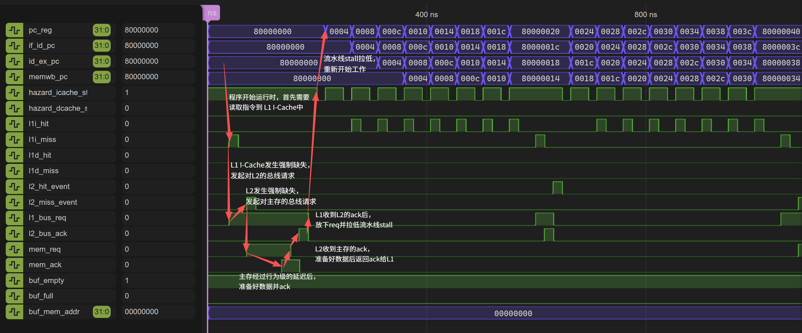
        <span style="font-size: 14px; color: #666; margin-top: 8px;">图 8：程序启动时存储系统的行为</span>
    </div>
每一个程序启动时，都要先将程序载入各级存储，L1 I-Cache 和 L2 Cache 会发生强制缺失。上图展示了这段时间内各级存储的行为：

1. `pc` 复位到 `0x80000000` 
2. L1 I-Cache 缺失，发起 L2 总线读请求
3. L2 缺失，发起主存总线读请求
4. 主存处理请求，准备好数据，2 周期后返回 ack
5. L2 收到主存的 ack，放下总线读请求，并返回 ack 给 L1 I-Cache
6. L1 I-Cache 收到 L2 的 ack，放下总线读请求，并释放流水线
7. 流水线开始正常工作


<div style="display: flex; flex-direction: column; align-items: center; flex-shrink: 1;">
        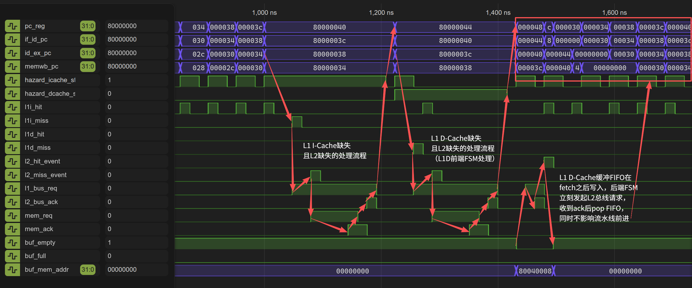
        <span style="font-size: 14px; color: #666; margin-top: 8px;">图 9：缓存系统控制逻辑对 L1 Cache 缺失的处理，以及 L1 D-Cache 对 L2 的 Miss Fetch 后写入</span>
    </div>
上图展示的是程序执行过程中碰到 L1 Cache 缺失时各级硬件的行为，大致与先前展示的程序启动时的行为相同，并且可以发现流水线在存储系统处理缺失的过程中是正常停顿的。另外，这张波形截图还展示了 L1 D-Cache 在 fetch 到缺失块后，向 L2 执行写操作的行为：

1. L1 D-Cache 的 FIFO 中填入了数据，`empty` 被拉低
2. L1 D-Cache 的后端 FSM 检测到有缓冲的数据需要写入 L2，发起 L2 总线写请求
3. L2 收到请求，准备好数据后返回 ack 给 L1 D-Cache
4. L1 D-Cache 收到 ack 后 pop FIFO，一次缓冲写操作完成

另外，注意到 L1 D-Cache 的后端 FSM 工作过程中，流水线在正常工作，证明前后端 FSM 各司其职地完成了工作，充分利用并行提高了访存效率。


<div style="display: flex; flex-direction: column; align-items: center; flex-shrink: 1;">
        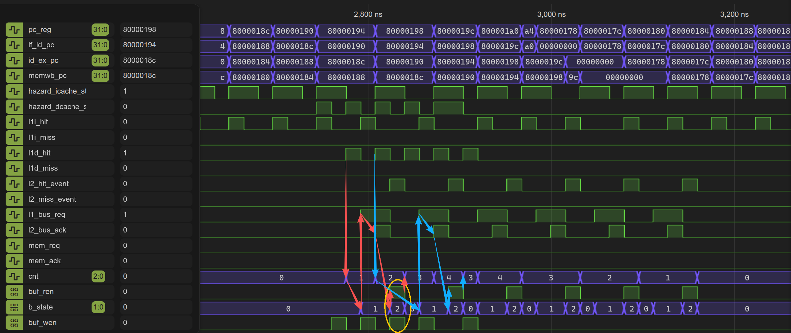
        <span style="font-size: 14px; color: #666; margin-top: 8px;">图 10：L1 D-Cache 缓冲 FIFO 的充满、排空行为以及读写冲突示例</span>
    </div>
上图来自矩阵乘法测试例（典型的密集数据访存测试），它展示了高写入压力下的标志性写缓冲行为。红色箭头和蓝色箭头各展示了一次将 FIFO 中数据写入 L2 的行为。以蓝色箭头为例，具体过程如下：

1. L1 D-Cache 写命中，数据压入 FIFO，FIFO 指针移一位（`cnt += 1`）
2. L1 D-Cache 的后端 FSM 在处理完上次写任务后，处理这次新的写入，拉起 L2 总线请求
3. L2 确认请求后，返回 ack 给 L1 D-Cache
4. L1 D-Cache 的后端 FSM 收到 ack 后，使能 FIFO 读，将这次写完成的数据弹出，FIFO 指针回退一位（`cnt -= 1`）
5. L2 收到弹出的数据，执行写入

然而，目前的解耦状态机设计会导致 FIFO 的读写冲突，具体可见黄色圈标记的地方：本组写操作的第三个数据压入和第一个数据弹出同时发生（在同一次 L2 总线请求中）。目前的 FIFO 和状态机设计会让 FIFO 写 override FIFO 读，即压入优先于弹出（优先保证流水线看到的行为是正确的），当次 FIFO 读（数据弹出）会自动顺延到下一次。对于如图所示的情形，即红色箭头所示的流程没有成功将第一个压入的数据写入 L2，而是放在蓝色箭头所示的流程中执行。`buf_wen` 的 5 个脉冲分别标示了 5 次压入，`buf_ren` 的 5 个脉冲分别标示了 5 次弹出，使用 FIFO 指针的移动情况检验，可以发现缓冲的行为是正确的。

### 各测试例性能统计情况与分析

总体而言，可以发现如下几个规律：

1. 由于各程序指令数量较少，但执行并发射的指令很多，L1 I-Cache 只会发生一次或几次强制缺失，命中率非常高；
2. 对于数据访存，L1 D-Cache 缺失率较低时，往往 L2 缺失率较高。反之则 L2 缺失率较低。这是因为 L1 D-Cache 缺失率高时，它访问 L2 的次数就多，而 L2 的容量和块大小都比较大，基本只会发生强制缺失，访问次数越多它的命中率就越高。L1 D-Cache 缺失率较低时，它不怎么需要访问 L2，L2 的访问次数大大减少，缺失次数基本不变的情况下，命中率就会下降；
3. 在执行并发射的指令量非常大时（表中可以用 Total Cycles / CPI 来获取），总体命中率一般会很高，因为基本只有 L2 发生强制缺失时，才会发起主存访问请求；
4. 缓存命中率的高低和 CPI 没有直接联系，需要对具体测试例做具体分析；AMAT 则与缓存命中率直接相关，任何一个缺失率数据上去了，AMAT 就会增加。

对于一些通用的规律，下面的各程序具体分析中就不再赘述。

#### 冲突处理测试程序

```txt
==============================================================================
--------------------------- PERFORMANCE COMPARISON ---------------------------
==============================================================================
| Metric               | Baseline (No Cache)  | Cache System                 |
------------------------------------------------------------------------------
| Total Cycles         | 44129                | 24329                        |
| Estimated Cycles     | 835185               | 46231                        |
| CPI                  | 8.592                | 5.912                        |
| Estimated CPI        | 162.612              | 11.234                       |
------------------------------------------------------------------------------
| L1 I-Cache Hit Rate  | N/A                  | 99.99% (7047/7048)           |
| L1 D-Cache Hit Rate  | N/A                  | 87.40% (895/1024)            |
| L2 Cache Hit Rate    | N/A                  | 96.62% (1917/1984)           |
| Overall Hit Rate     | N/A                  | 99.17% (8005/8072)           |
------------------------------------------------------------------------------
| Estimated AMAT       | 100.00 cycles        | 1.84 cycles                  |
| Speedup              | 1.00x                | 18.07x                       |
==============================================================================
```

这个测试程序是计算斐波那契数列，相当于对数组的一种特殊遍历，时间局部性比较好，因此各级缓存的命中率都比较高。CPI 较高主要是因为程序执行过程中需要频繁地执行分支操作（循环），非访存所致流水线冲突比较多。

#### 嵌套调用测试程序

```txt
==============================================================================
--------------------------- PERFORMANCE COMPARISON ---------------------------
==============================================================================
| Metric               | Baseline (No Cache)  | Cache System                 |
------------------------------------------------------------------------------
| Total Cycles         | 1361                 | 803                          |
| Estimated Cycles     | 24489                | 2295                         |
| CPI                  | 8.053                | 7.170                        |
| Estimated CPI        | 144.901              | 20.492                       |
------------------------------------------------------------------------------
| L1 I-Cache Hit Rate  | N/A                  | 99.44% (179/180)             |
| L1 D-Cache Hit Rate  | N/A                  | 98.21% (55/56)               |
| L2 Cache Hit Rate    | N/A                  | 86.49% (64/74)               |
| Overall Hit Rate     | N/A                  | 95.76% (226/236)             |
------------------------------------------------------------------------------
| Estimated AMAT       | 100.00 cycles        | 1.28 cycles                  |
| Speedup              | 1.00x                | 10.67x                       |
==============================================================================
```

这个程序通过子函数计算组合数，执行过程中会出现较多层级的递归调用。由于递归调用过程中会使用栈（空间局部性和时间局部性都很好），这个程序仿真得到的 L1 D-Cache 命中率比较高，只有一次强制缺失。CPI 高也是因为程序执行过程中频繁的分支操作，非访存所致流水线冲突比较多。

#### 分支处理和字节访存测试程序

```txt
==============================================================================
--------------------------- PERFORMANCE COMPARISON ---------------------------
==============================================================================
| Metric               | Baseline (No Cache)  | Cache System                 |
------------------------------------------------------------------------------
| Total Cycles         | 3270                 | 1734                         |
| Estimated Cycles     | 57268                | 2300                         |
| CPI                  | 8.278                | 6.669                        |
| Estimated CPI        | 144.974              | 8.846                        |
------------------------------------------------------------------------------
| L1 I-Cache Hit Rate  | N/A                  | 99.81% (517/518)             |
| L1 D-Cache Hit Rate  | N/A                  | 96.97% (32/33)               |
| L2 Cache Hit Rate    | N/A                  | 91.89% (34/37)               |
| Overall Hit Rate     | N/A                  | 99.46% (548/551)             |
------------------------------------------------------------------------------
| Estimated AMAT       | 100.00 cycles        | 1.29 cycles                  |
| Speedup              | 1.00x                | 24.90x                       |
==============================================================================
```

这个程序统计了特定字符串内元音的个数，由于字符串中元音较少，程序执行过程中的跳转次数不多，因此 CPI 比较低。另外，字符串占用的存储空间较少，L1 D-Cache 只发生了一次强制缺失。

#### 矩阵乘法测试程序

**MMA**

```txt
==============================================================================
--------------------------- PERFORMANCE COMPARISON ---------------------------
==============================================================================
| Metric               | Baseline (No Cache)  | Cache System                 |
------------------------------------------------------------------------------
| Total Cycles         | 7197976              | 4147723                      |
| Estimated Cycles     | 138017588            | 4244741                      |
| CPI                  | 9.379                | 8.030                        |
| Estimated CPI        | 179.838              | 8.218                        |
------------------------------------------------------------------------------
| L1 I-Cache Hit Rate  | N/A                  | 100.00% (1265261/1265262)    |
| L1 D-Cache Hit Rate  | N/A                  | 92.85% (64653/69632)         |
| L2 Cache Hit Rate    | N/A                  | 98.01% (9714/9911)           |
| Overall Hit Rate     | N/A                  | 99.99% (1334697/1334894)     |
------------------------------------------------------------------------------
| Estimated AMAT       | 100.00 cycles        | 1.43 cycles                  |
| Speedup              | 1.00x                | 32.51x                       |
==============================================================================
```

**MMB**

```txt
==============================================================================
--------------------------- PERFORMANCE COMPARISON ---------------------------
==============================================================================
| Metric               | Baseline (No Cache)  | Cache System                 |
------------------------------------------------------------------------------
| Total Cycles         | 7452952              | 4334575                      |
| Estimated Cycles     | 144844346            | 5369641                      |
| CPI                  | 9.326                | 7.905                        |
| Estimated CPI        | 181.246              | 9.793                        |
------------------------------------------------------------------------------
| L1 I-Cache Hit Rate  | N/A                  | 100.00% (1299552/1299553)    |
| L1 D-Cache Hit Rate  | N/A                  | 96.63% (98953/102400)        |
| L2 Cache Hit Rate    | N/A                  | 99.85% (126970/127167)       |
| Overall Hit Rate     | N/A                  | 99.99% (1401756/1401953)     |
------------------------------------------------------------------------------
| Estimated AMAT       | 100.00 cycles        | 1.17 cycles                  |
| Speedup              | 1.00x                | 26.97x                       |
==============================================================================
```

**MMC**

1. 分块规模为 16
	```txt
	==============================================================================
	--------------------------- PERFORMANCE COMPARISON ---------------------------
	==============================================================================
	| Metric               | Baseline (No Cache)  | Cache System                 |
	------------------------------------------------------------------------------
	| Total Cycles         | 7284830              | 4188496                      |
	| Estimated Cycles     | 139684398            | 4328762                      |
	| CPI                  | 9.346                | 7.925                        |
	| Estimated CPI        | 179.207              | 8.190                        |
	------------------------------------------------------------------------------
	| L1 I-Cache Hit Rate  | N/A                  | 100.00% (1278288/1278292)    |
	| L1 D-Cache Hit Rate  | N/A                  | 94.11% (68444/72724)         |
	| L2 Cache Hit Rate    | N/A                  | 98.68% (15071/15272)         |
	| Overall Hit Rate     | N/A                  | 99.99% (1350815/1351016)     |
	------------------------------------------------------------------------------
	| Estimated AMAT       | 100.00 cycles        | 1.33 cycles                  |
	| Speedup              | 1.00x                | 32.27x                       |
	==============================================================================
	```

2. 分块规模为 8
	```txt
	==============================================================================
	--------------------------- PERFORMANCE COMPARISON ---------------------------
	==============================================================================
	| Metric               | Baseline (No Cache)  | Cache System                 |
	------------------------------------------------------------------------------
	| Total Cycles         | 7438334              | 4258553                      |
	| Estimated Cycles     | 142399916            | 4448523                      |
	| CPI                  | 9.289                | 7.745                        |
	| Estimated CPI        | 177.829              | 8.090                        |
	------------------------------------------------------------------------------
	| L1 I-Cache Hit Rate  | N/A                  | 100.00% (1300335/1300339)    |
	| L1 D-Cache Hit Rate  | N/A                  | 95.07% (73034/76820)         |
	| L2 Cache Hit Rate    | N/A                  | 99.06% (21284/21485)         |
	| Overall Hit Rate     | N/A                  | 99.99% (1376958/1377159)     |
	------------------------------------------------------------------------------
	| Estimated AMAT       | 100.00 cycles        | 1.27 cycles                  |
	| Speedup              | 1.00x                | 32.01x                       |
	==============================================================================
	```

对于矩阵乘法测试例的结果，我们进行横向比对，分析几个有趣的现象：

1. 正如先前提到的，MMB 的运行结果实际上是最差的。我们对数据进行简单的定量分析，MMB 的 Store 次数是 32 $\times$ 32 $\times$ 32 = 32768 次，MMA 的 Store 次数是 32 $\times$ 32 = 1024 次，MMB 相比 MMA 多执行了 31744 条指令，但实际上根据二者的 L1 I-Cache 访问次数，MMB 比 MMA 多执行了 34291 条指令，还有两千多条指令用于控制等逻辑。由于写回时访问的是相同的地址，我们可以假设二者写回时碰到的 Miss 次数是一样的，这样 MMB 多出的这部分执行周期数就是多出来的 Store 次数乘上单次写 Hit 的耗时。由于我们采用了 L1 D-Cache 状态机解耦的设计，写缓冲花费的时间是无需另外计算的（且缓冲 FIFO 极少在 full 时产生流水线停顿），由此可以得出 MMB 这部分多花费的实际周期数约为 (32768 - 1024) $\times$ 2 = 63488，加上每次 L1 I-Cache Hit 需要的 3 个周期和 `C[i][j] += mul(r, B[k][j]);` 引入的 Load-Use 冒险，共多出了 34291 $\times$ 3 + 32768 + 63488 = 199129 个周期，略大于二者的总周期数差（4334575 - 4147723 = 186852），考虑到 MMB 的优化效果，这个估计结果是比较准确的；
2. 尽管 MMC 的 CPI 是最低的，但由于循环层数增加，用于控制逻辑的指令变多，跑出的总周期数略多于 MMA；
3. MMC 的分块规模为 8 时，CPI 低于分块规模为 16 时的，但是花费的总周期数更多。花费周期数更多比较好理解，因为分块规模小时，外层循环次数更多，控制所需要的指令更多，包括维护循环计数器、计算分支跳转以及计算内存地址偏移等。对于 CPI 的结果，我们做简单的定量分析，L1 D-Cache 中每一路的容量为 4KB，分块规模为 16 时，一个分块的总存储容量（包括 A, B, C 三个矩阵）为 16 $\times$ 16 $\times$ 4 $\times$ 3 = 3KB，看起来不会发生驱逐，但实际上 MMC 对于每一个分块的处理是和 MMA 类似的，数据地址分布并不连续，因此会发生大量的冲突未命中。当分块规模为 8 时，一个分块的总存储容量为 8 $\times$ 8 $\times$ 4 $\times$ 3 = 768B，L1 D-Cache 处理起来就更得心应手，因此命中率更高，CPI 也更高了。

#### 大数组遍历测试程序

**顺序遍历**

```txt
==============================================================================
--------------------------- PERFORMANCE COMPARISON ---------------------------
==============================================================================
| Metric               | Baseline (No Cache)  | Cache System                 |
------------------------------------------------------------------------------
| Total Cycles         | 531722               | 318691                       |
| Estimated Cycles     | 9679728              | 396185                       |
| CPI                  | 9.104                | 17.255                       |
| Estimated CPI        | 165.734              | 21.451                       |
------------------------------------------------------------------------------
| L1 I-Cache Hit Rate  | N/A                  | 100.00% (88737/88738)        |
| L1 D-Cache Hit Rate  | N/A                  | 58.32% (2688/4609)           |
| L2 Cache Hit Rate    | N/A                  | 97.40% (7298/7493)           |
| Overall Hit Rate     | N/A                  | 99.79% (93152/93347)         |
------------------------------------------------------------------------------
| Estimated AMAT       | 100.00 cycles        | 3.63 cycles                  |
| Speedup              | 1.00x                | 24.43x                       |
==============================================================================
```

顺序遍历时，空间局部性比较好，但是时间局部性较差，数据用一次以后就不再用了，因为数组的大小超过了 L1 缓存的容量，下次用到的时候已经全部更新了一遍，又会造成 miss。值得注意的是，本测试中得到的 CPI 结果十分夸张，这是因为测试程序的循环体只用了 5 条指令，而这 5 条指令中又包含了 Load-Use 和分支跳转，导致花费的周期数很高。

**质数步长遍历**

```txt
==============================================================================
--------------------------- PERFORMANCE COMPARISON ---------------------------
==============================================================================
| Metric               | Baseline (No Cache)  | Cache System                 |
------------------------------------------------------------------------------
| Total Cycles         | 5128430              | 2911347                      |
| Estimated Cycles     | 91633324             | 3782077                      |
| CPI                  | 8.026                | 6.834                        |
| Estimated CPI        | 143.406              | 8.878                        |
------------------------------------------------------------------------------
| L1 I-Cache Hit Rate  | N/A                  | 100.00% (800797/800799)      |
| L1 D-Cache Hit Rate  | N/A                  | 17.50% (14336/81904)         |
| L2 Cache Hit Rate    | N/A                  | 98.94% (96236/97265)         |
| Overall Hit Rate     | N/A                  | 99.88% (881674/882703)       |
------------------------------------------------------------------------------
| Estimated AMAT       | 100.00 cycles        | 5.56 cycles                  |
| Speedup              | 1.00x                | 24.23x                       |
==============================================================================
```

使用质数步长遍历数组时，由于每次访问新元素都会 Miss，D-Cache 命中率极低。剩下的 14336 次 Hit 来自数组的初始化（顺序访问）：数组共 16384 个元素，缓存的块大小是 32B，每一个块可以存放 8 个元素，每个块后 7 个元素会命中，因此总命中次数为 16384 / 8 * 7 = 14436 次，总访问次数为 16384 * 5 = 81920 ，但这比实际得到的结果多了 16 次访问，这可能是因为某些局部变量被分配给了寄存器，或者是硬件性能计数器的启动延迟/采样误差所致。该测试例得到的总周期数远大于顺序访问，是因为它的数组规模是顺序访问的 5 倍，且循环体使用了 9 条指令。

### 参数探索结果与分析

#### 单一参数探索

<div style="display: flex; flex-direction: column; align-items: center; flex-shrink: 1;">
        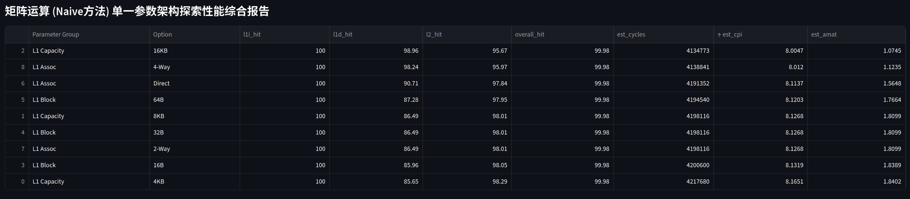
        <span style="font-size: 14px; color: #666; margin-top: 8px;">表 1：矩阵运算测试例各情形各级缓存命中率和处理器性能相关信息</span>
    </div>

<div style="display: flex; flex-direction: column; align-items: center; flex-shrink: 1;">
        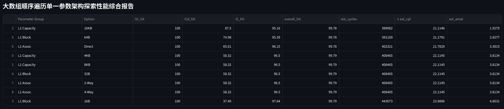
        <span style="font-size: 14px; color: #666; margin-top: 8px;">表 2：大数组顺序访问测试例各情形各级缓存命中率和处理器性能相关信息</span>
    </div>
<div style="display: flex; flex-direction: column; align-items: center; flex-shrink: 1;">
        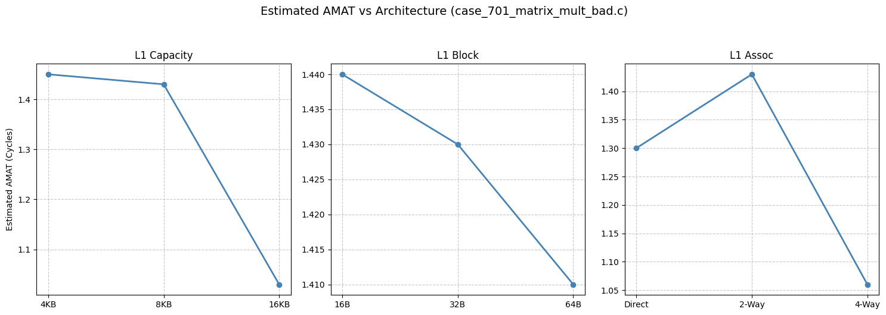
        <span style="font-size: 14px; color: #666; margin-top: 8px;">图 11：矩阵运算测试例下各情形 AMAT 对比</span>
    </div>

<div style="display: flex; flex-direction: column; align-items: center; flex-shrink: 1;">
        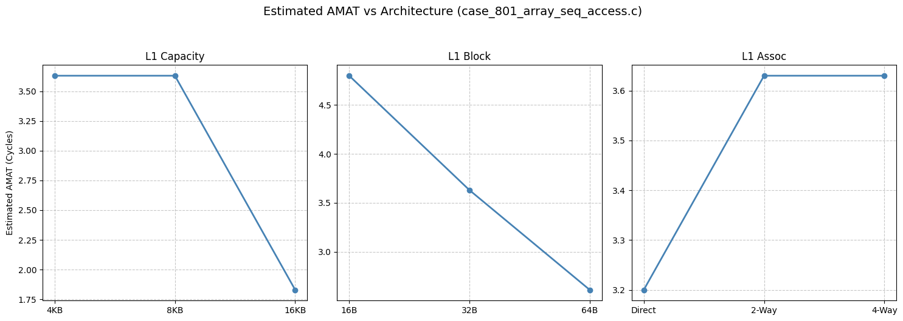
        <span style="font-size: 14px; color: #666; margin-top: 8px;">图 12：大数组顺序访问测试例下各情形 AMAT 对比</span>
    </div>
表 1 和表 2 已经使用 est_cpi 做了升序排序，对于这两个测试，使用 est_cpi 做排序和使用 est_cycles 做排序的结果是一样的。

对于矩阵乘法测试例，可以分析得到如下结果：

1. 当 L1 缓存容量达到 16KB 时，它超过了 3 个矩阵的存储空间总和，因此不会发生容量未命中，缓存缺失主要来自 2 路无法同时存储 3 个矩阵（矩阵中偏移相同的元素会被映射到同一缓存组中），因此这种情况的 L1 D-Cache 的命中率最高，且花费的周期数也最少；

2. 当 L1 缓存的组相联度到达 4 路组相联后，冲突未命中得到了极大的缓解，尤其是 4 路可以同时容纳 3 个矩阵，但是只有 8KB 的空间，会发生大量的容量未命中，因此这种情况的缺失率相较于其他 8KB 容量的情形是最低的，花费的周期数也相对最少。另外，对比前两名的数据可以发现，这种规模的矩阵乘法对于我们的设计来说，容量未命中和冲突未命中带来的惩罚比较接近；

3. 比较出人意料的是直接映射的情形，它的性能表现由于默认的 2 路组相联，甚至超过了将缓存块大小提升为 64B 的情形，这主要是因为它规避了 2 路组相联的 LRU 颠簸问题：对于 2 路组相联的情形，由于每路的容量刚好是 4KB ，三个矩阵各自元素在缓存中的映射地址每次都一模一样，在矩阵乘法运算过程中会发生如下情形

   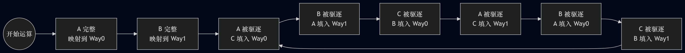

   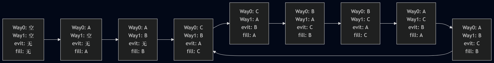

   即在进入稳态后，所有下一次要用到的数据都会在前一次访存后被驱逐，因此每次数据访存都会 miss。而对于直接映射的情形，A 和 B 会分别被完整映射到缓存的前后两部分，载入 C 只会驱逐 A，而空间局部性较差的 B 不会被反复驱逐，因此缺失率和总周期数数据相对理想；

4. 将 L1 缓存的块大小提升到 64B 后，空间局部性得到改善，可以显著提高 A 矩阵访问的命中率，但是对 B 矩阵访问没有帮助，因此相对于默认情形只带来了较小的收益；

5. 减小缓存容量相比于减少块大小对整体性能损失的影响更大，这体现在 16B 块大小的情形性能略好于 4KB 容量的情形；

6. 由于这个测试例数据规模大，执行指令数量多，缓存命中率高也意味着更好的性能表现（执行周期数少）。

对于大数组顺序遍历测试例，它在数组初始化完成后，除了缓存容量为 16KB 的情形，完全没有时间局部性：数组所需的空间是 3KB $\times$ 4 = 12KB，下一次遍历开始时，原先存储的内容已经被驱逐，形成大量容量未命中，对于 4KB 和 8KB 容量，L1 D-Cache 命中率不会有任何区别；对于 16KB 容量的情形，数组可以完整地存放在 L1 缓存中，根据块大小（32B，容纳 8 个数组元素），L1 D-Cache 命中率就是严格的 87.5%（1 次强制缺失：7次命中）。另外，由于同时只对一个数组做处理，程序运行过程中不会发生冲突未命中，提高缓存组相联度不会带来任何性能改善，反而因为 LRU 策略的频繁驱逐，性能不及拥有哈希隔离特性的直接映射情形（直接映射时，中间的 4KB 会一直得到保留，只有 0\~4KB 和 8\~12KB 会一直互相驱逐）。对于块大小改变带来的缺失率与性能变化，依然可以用空间局部性的改变来解释，尤其是这个测试例极度突出空间局部性的效用。

#### 相联度-块大小探索

<div style="display: flex; flex-direction: column; align-items: center; flex-shrink: 1;">
        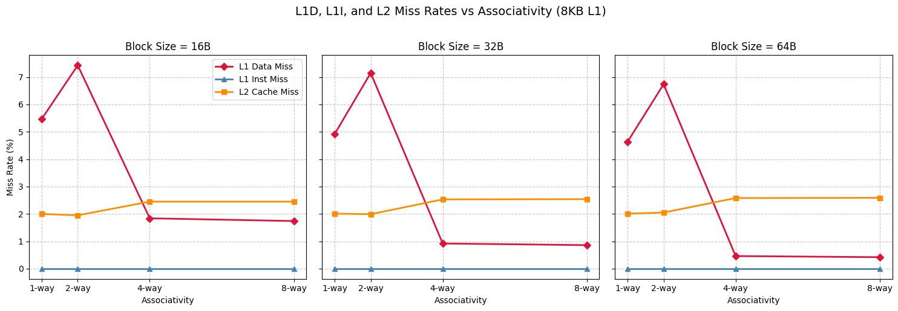
        <span style="font-size: 14px; color: #666; margin-top: 8px;">图 13：按照 L1 缓存分块大小分别绘制的相联度-各级缓存缺失率折线图</span>
    </div>

<div style="display: flex; flex-direction: column; align-items: center; flex-shrink: 1;">
        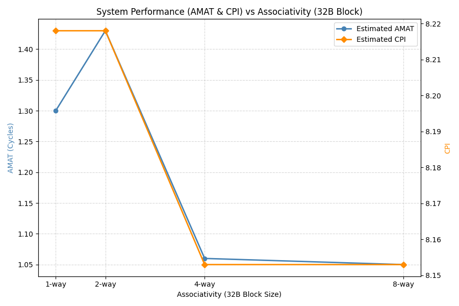
        <span style="font-size: 14px; color: #666; margin-top: 8px;">图 14：使用 32B 分块时的相联度-AMAT/CPI 折线图</span>
    </div>
相联度-块大小探索使用 MMA 测试例完成。图 13 主要展示了如下信息（原因在前面都已做过分析）：

1. 2 路组相联使用 LRU 策略时，会产生 LRU 颠簸，导致性能比直接映射还差；
2. 4 路组相联处理冲突未命中能力已经较强，再增加组相联程度不会带来显著的性能提升；
3. 缓存块大小越大，空间局部性越好，L1 D-Cache 的命中情况越好（红色折现随着缓存块大小增大而逐渐整体下移）；
4. 对于这个测试，L1 D-Cache 命中率较高时，L2 Cache 命中率往往较低，反之亦然；

另外，观察图 14 可以看出，直接映射虽然命中率优于 2 路组相联，但 CPI 的优化相对很小，因为整个测试的访存次数非常多，且 L1 D-Cache 的缺失大部分可以在 L2 中命中，实际相差的总执行周期数并不多。

#### 局部性探索

<div style="display: flex; flex-direction: column; align-items: center; flex-shrink: 1;">
        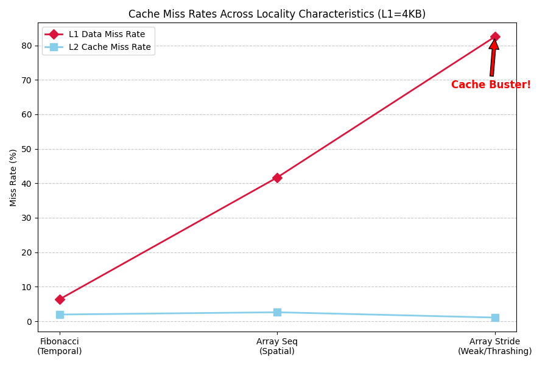
        <span style="font-size: 14px; color: #666; margin-top: 8px;">图 15：使用各种局部性测试时，各级缓存的缺失率对比</span>
    </div>
局部性探索中，将 L1 缓存的容量设为 4KB，以突出质数步长访问时极低的 L1 D-Cache 命中率。但因为数组规模超过了 L1 缓存的容量，顺序访问时因为发现大量容量未命中，缺失率也比较高。如果既要体现顺序访问和质数步长访问体现的空间局部性差异，又要让时间局部性好的测试与空间局部性好的程序都拥有较高的命中率，就要让斐波那契数列计算测试例使用极大的数组规模，但是这样做以后，计算得到的整数结果将超出 32 位系统的上限，因此暂时不考虑。另外，每个测试的结果在前面均有做过分析，这里不再赘述。

### 综合实现 PPA 评估

在 speed 优先组合策略下，对于默认情形（8KB L1 容量，32B L1 块大小，L1 两路组相联；64KB L2 容量，64B L2 块大小，L2 四路组相联），综合实现的结果可以满足 62.5MHz 时序要求，此时消耗的资源和功耗情况如下表（详见 PPA 结果报告，在 `PRJ_PATH/src/report/SPEED/` 目录下）：

|         PPA 实现情况         |   有缓存情形   | 无缓存情形 |
| :--------------------------: | :------------: | :--------: |
|       **Period (ns)**        |       16       |     16     |
|     **Frequency (MHz)**      |      62.5      |    62.5    |
|        **LUT Util%**         |      7.76      |    6.34    |
|      **Register Util%**      |      2.71      |    1.16    |
|        **MUX Util%**         |      2.32      |    7.5     |
|      **Ctrl Set Util%**      |      0.59      |    0.62    |
|        **BRAM Util%**        | 13.33（18 个） |     0      |
| **Total on Chip Power (mW)** |      121       |    137     |
|    **Dynamic Power (mW)**    |       36       |     53     |
|    **Static Power (mW)**     |       85       |     84     |

> 无缓存情形数据来自上一次项目。

由于使用了 BRAM，有缓存情形一般资源的使用情况相较无缓存情形没有增加特别多，MUX 和专用控制逻辑甚至使用得更少了。另外，有缓存情形的动态功耗明显降低，这主要来自 BRAM 相较于分布式存储的优化。结合有缓存情形带来的性能提升：每个测试例都能带来几十倍的加速，加入缓存系统带来的收益是极大的。

### Agent Skill 运行情况

下面这几组图展示了 Agent 执行各 Skill 时的前端交互界面。

#### 参数化缓存 RTL 设计生成与仿真

<div style="display: flex; justify-content: center; align-items: flex-start; gap: 15px; text-align: center;">
    <div style="display: flex; flex-direction: column; align-items: center; flex-shrink: 1;">
            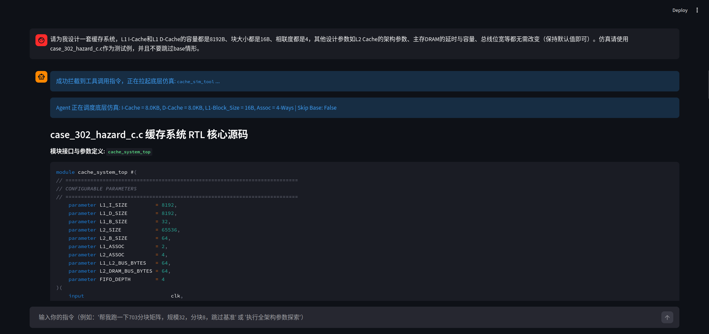
            <span style="font-size: 14px; color: #666; margin-top: 8px;">图 16：发起参数化缓存 RTL 设计任务请求并获取源码</span>
    </div>
    <div style="display: flex; flex-direction: column; align-items: center; flex-shrink: 1;">
            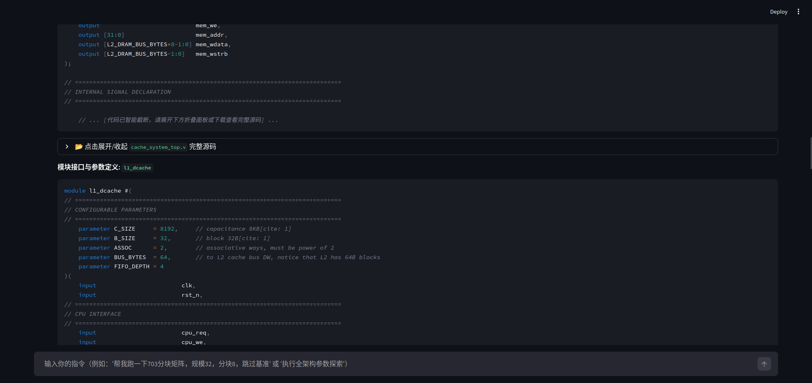
            <span style="font-size: 14px; color: #666; margin-top: 8px;">图 17：RTL 设计源码展示——过长代码的折叠与展开</span>
    </div>
</div>
<div style="display: flex; justify-content: center; align-items: flex-start; gap: 15px; text-align: center;">
    <div style="display: flex; flex-direction: column; align-items: center; flex-shrink: 1;">
            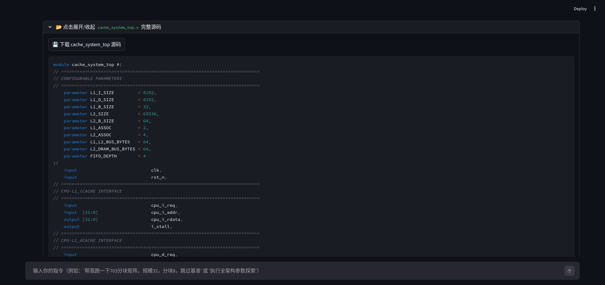
            <span style="font-size: 14px; color: #666; margin-top: 8px;">图 18：RTL 设计源码展示——源码下载界面</span>
    </div>
    <div style="display: flex; flex-direction: column; align-items: center; flex-shrink: 1;">
            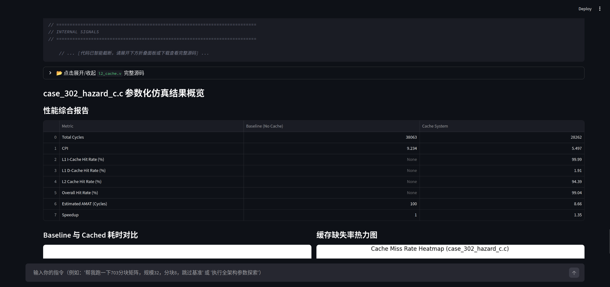
            <span style="font-size: 14px; color: #666; margin-top: 8px;">图 19：设计运行指定仿真测试例后的结果数据表展示</span>
    </div>
</div>

<div style="display: flex; justify-content: center; align-items: flex-start; gap: 15px; text-align: center;">
    <div style="display: flex; flex-direction: column; align-items: center; flex-shrink: 1;">
            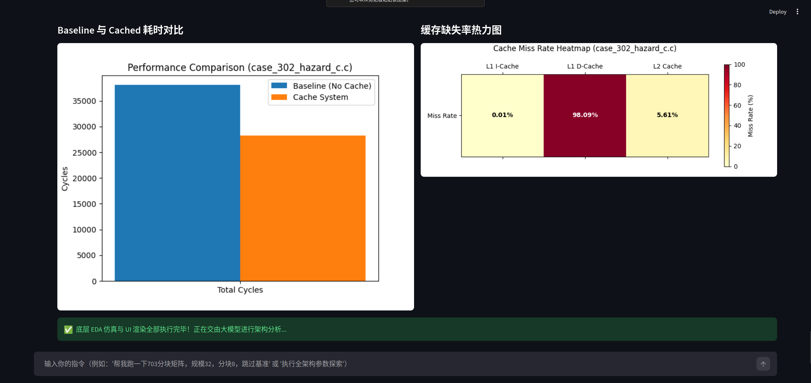
            <span style="font-size: 14px; color: #666; margin-top: 8px;">图 20：设计运行指定仿真测试例后的结果数据图展示</span>
    </div>
    <div style="display: flex; flex-direction: column; align-items: center; flex-shrink: 1;">
            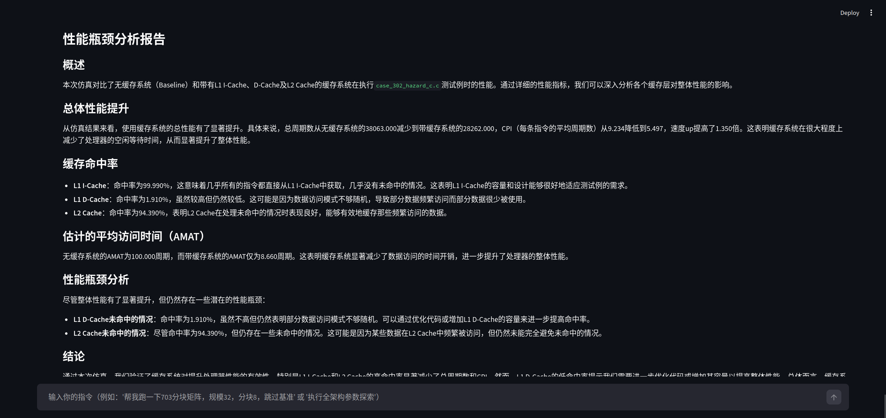
            <span style="font-size: 14px; color: #666; margin-top: 8px;">图 21：LLM 对仿真结果数据的分析示例</span>
    </div>
</div>

#### 矩阵运算测试程序自动生成与运行

<div style="display: flex; justify-content: center; align-items: flex-start; gap: 15px; text-align: center;">
    <div style="display: flex; flex-direction: column; align-items: center; flex-shrink: 1;">
            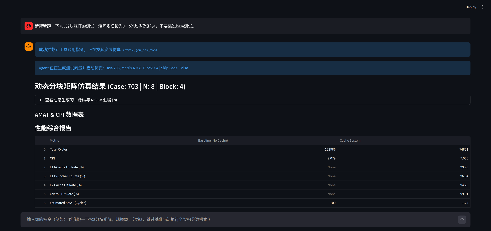
            <span style="font-size: 14px; color: #666; margin-top: 8px;">图 22：发起矩阵运算测试定制要求并获取 C 与汇编源码</span>
    </div>
    <div style="display: flex; flex-direction: column; align-items: center; flex-shrink: 1;">
            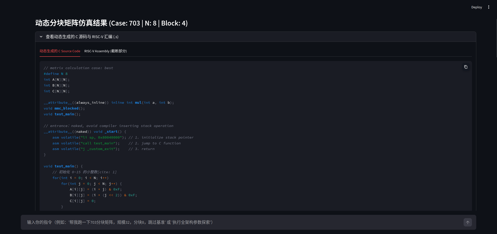
            <span style="font-size: 14px; color: #666; margin-top: 8px;">图 23：展开查看测试程序源码</span>
    </div>
</div>

<div style="display: flex; justify-content: center; align-items: flex-start; gap: 15px; text-align: center;">
    <div style="display: flex; flex-direction: column; align-items: center; flex-shrink: 1;">
            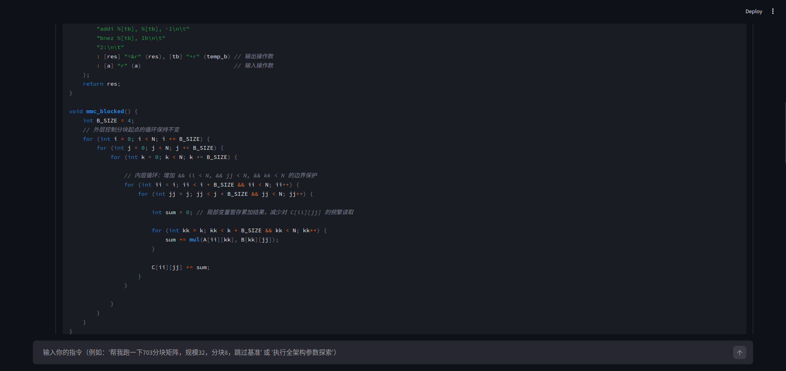
            <span style="font-size: 14px; color: #666; margin-top: 8px;">图 24：检查 C 与汇编源码修改是否正确</span>
    </div>
    <div style="display: flex; flex-direction: column; align-items: center; flex-shrink: 1;">
            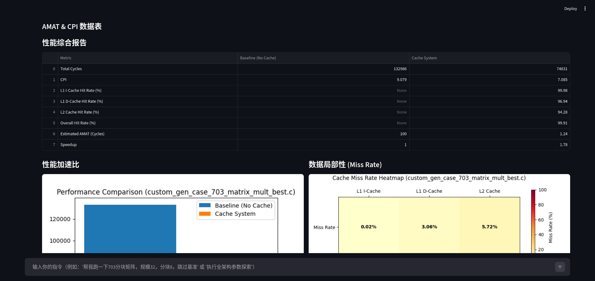
            <span style="font-size: 14px; color: #666; margin-top: 8px;">图 25：运行定制测试例后的结果数据表展示</span>
    </div>
</div>

<div style="display: flex; justify-content: center; align-items: flex-start; gap: 15px; text-align: center;">
    <div style="display: flex; flex-direction: column; align-items: center; flex-shrink: 1;">
            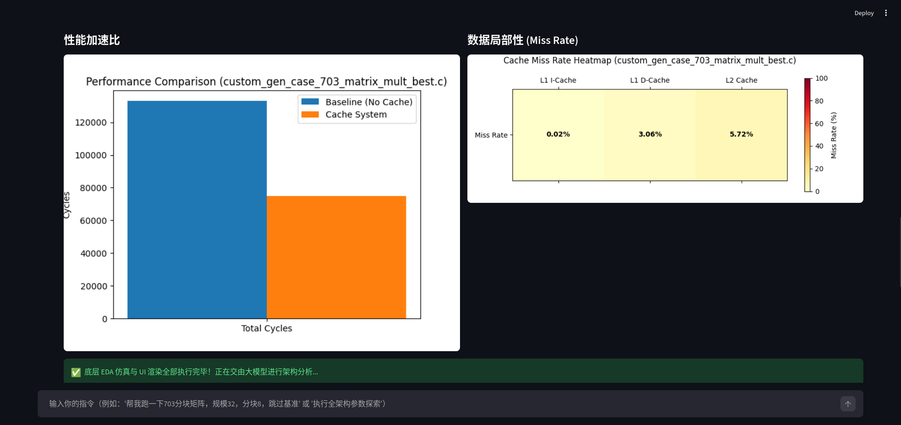
            <span style="font-size: 14px; color: #666; margin-top: 8px;">图 26：运行定制测试例后的结果数据图展示</span>
    </div>
    <div style="display: flex; flex-direction: column; align-items: center; flex-shrink: 1;">
            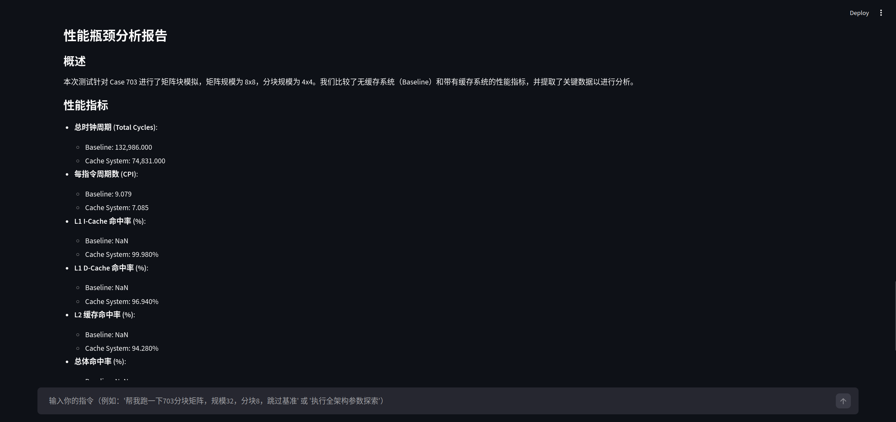
            <span style="font-size: 14px; color: #666; margin-top: 8px;">图 27：LLM 对仿真结果数据的分析示例</span>
    </div>
</div>
#### 架构参数探索

<div style="display: flex; width: 100%; gap: 15px; margin-bottom: 20px;">
    <div style="flex: 1; width: 50%; display: flex; flex-direction: column; align-items: center; justify-content: flex-end;">
        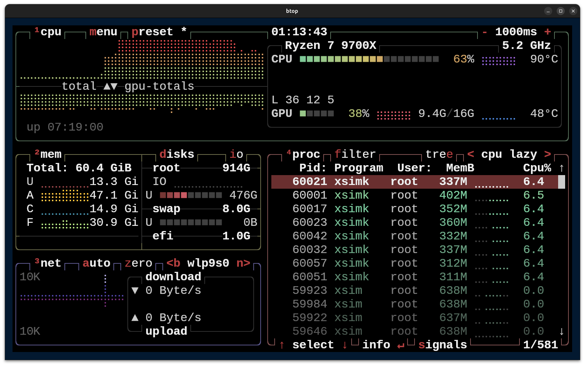
        <span style="font-size: 14px; color: #555; margin-top: 10px; text-align: center;">图 28：多线程并行仿真任务</span>
    </div>
    <div style="flex: 1; width: 50%; display: flex; flex-direction: column; align-items: center; justify-content: flex-end;">
        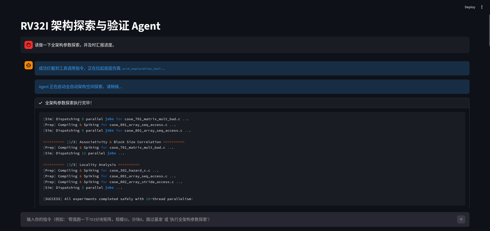
        <span style="font-size: 14px; color: #555; margin-top: 10px; text-align: center;">图 29：发起架构参数探索请求并展示仿真进度</span>
    </div>
</div>

<div style="display: flex; justify-content: center; align-items: flex-start; gap: 15px; text-align: center;">
    <div style="display: flex; flex-direction: column; align-items: center; flex-shrink: 1;">
            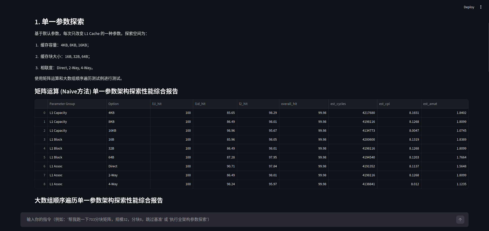
            <span style="font-size: 14px; color: #666; margin-top: 8px;">图 30：单一参数探索仿真结果数据表</span>
    </div>
    <div style="display: flex; flex-direction: column; align-items: center; flex-shrink: 1;">
            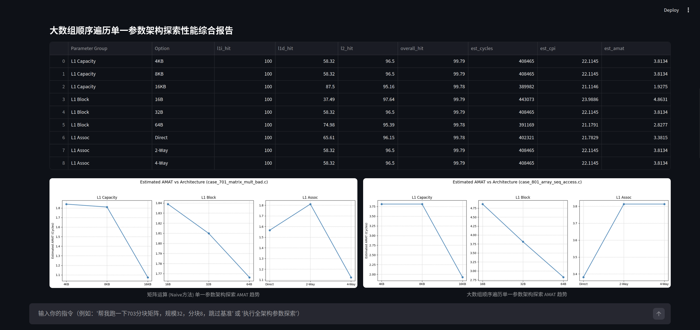
            <span style="font-size: 14px; color: #666; margin-top: 8px;">图 31：单一参数探索仿真结果数据图</span>
    </div>
</div>

<div style="display: flex; justify-content: center; align-items: flex-start; gap: 15px; text-align: center;">
    <div style="display: flex; flex-direction: column; align-items: center; flex-shrink: 1;">
            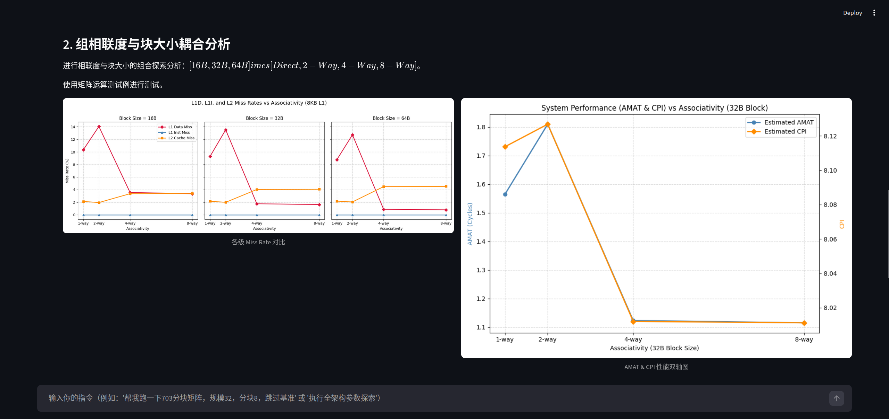
            <span style="font-size: 14px; color: #666; margin-top: 8px;">图 32：相联度探索仿真结果数据图</span>
    </div>
    <div style="display: flex; flex-direction: column; align-items: center; flex-shrink: 1;">
            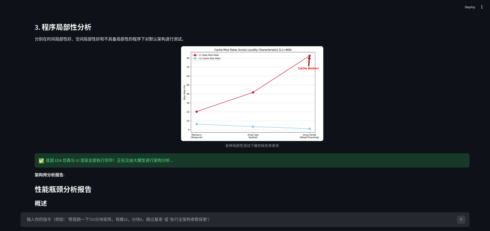
            <span style="font-size: 14px; color: #666; margin-top: 8px;">图 33：局部性探索仿真结果数据图</span>
    </div>
</div>

<div style="display: flex; justify-content: center; align-items: flex-start; gap: 15px; text-align: center;">
    <div style="display: flex; flex-direction: column; align-items: center; flex-shrink: 1;">
            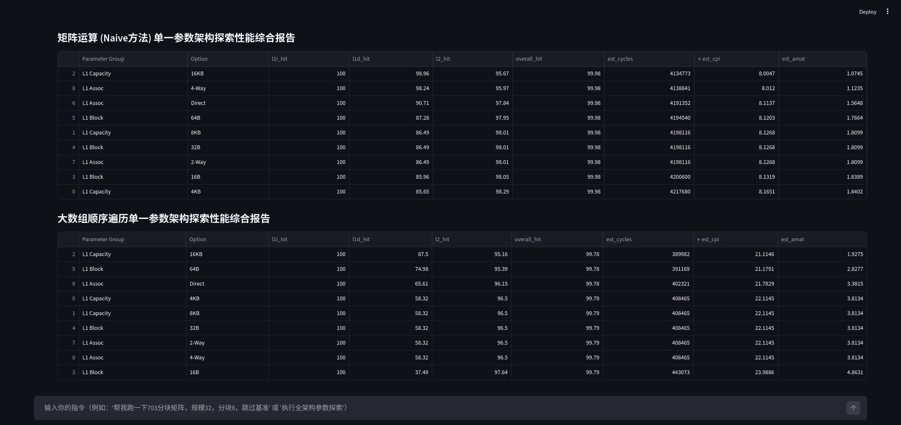
            <span style="font-size: 14px; color: #666; margin-top: 8px;">图 34：表格排序功能示例（以 CPI 为基准）</span>
    </div>
    <div style="display: flex; flex-direction: column; align-items: center; flex-shrink: 1;">
            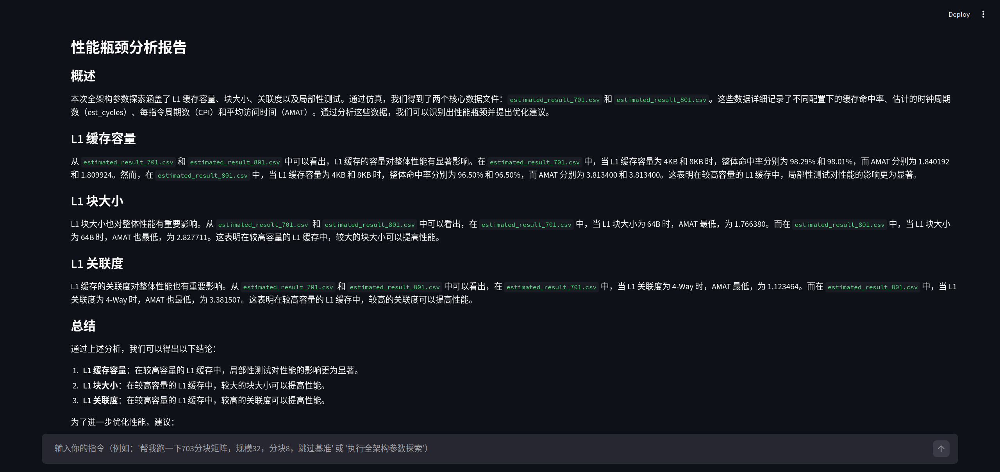
            <span style="font-size: 14px; color: #666; margin-top: 8px;">图 35：LLM 对仿真结果数据的分析示例</span>
    </div>
</div>
## GitHub 仓库介绍

这次大作业项目的源代码已经全部开源到 GitHub，项目地址为 https://github.com/L6004/RV32I_Cached_4stage_CPU-working-with-agent/，具体使用方法参见 `README.md` 和本报告中前面的说明。

## 项目主体目录

目录结构总体与上次项目相似，主要有以下几点不同：

1. 在 sim 目录下增加了 arch_exp 目录，存放全架构参数探索的结果；
2. sim 目录下的汇编测试例源文件合并为一个，不再分为专供 DUV 和 Spike 两种版本的了；
3. sim 目录下新增了 saif 目录，存放前仿和后仿得到的翻转率记录文件（目前只保留了前仿的结果）；
4. Agent Skill 相关的文件全部放在根目录下。
